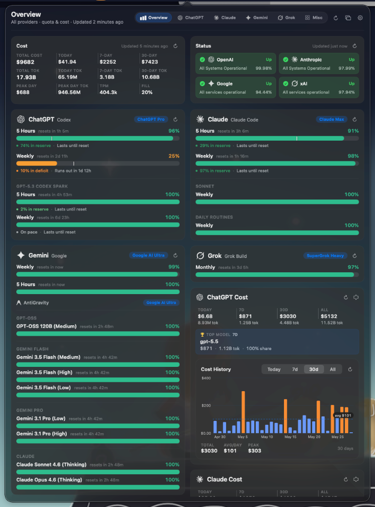
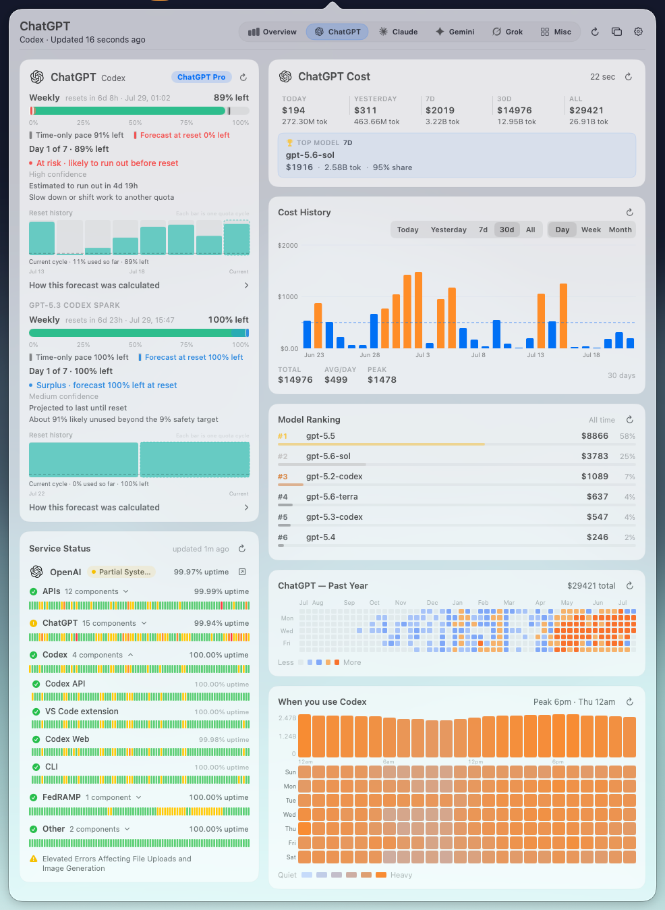
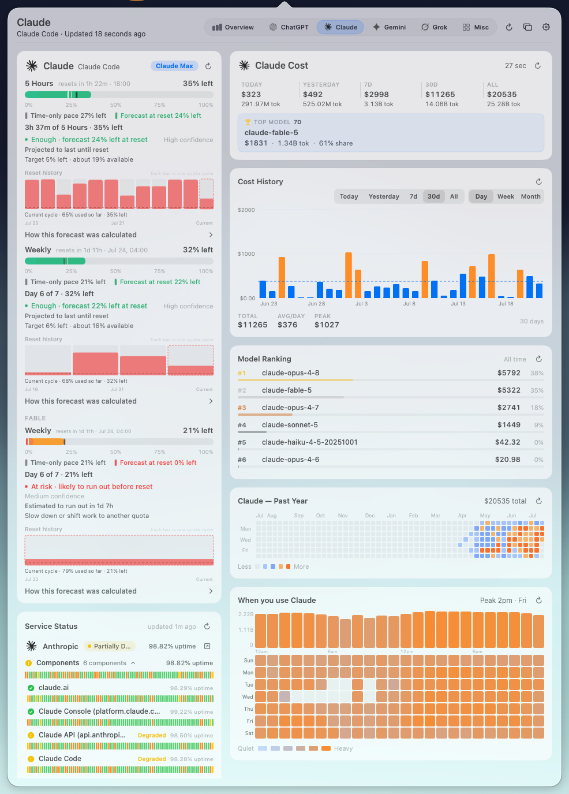
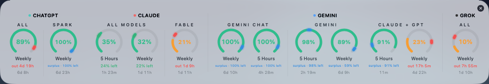
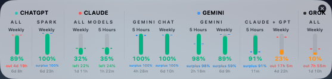
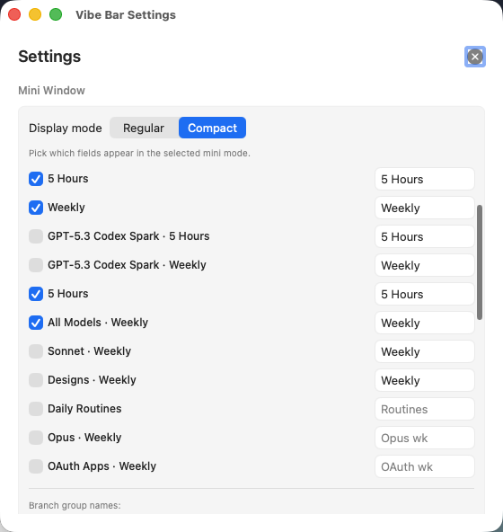

# Vibe Bar

Vibe Bar is a native macOS menu-bar app for keeping an eye on AI subscription
usage, local token cost, service status, and compact floating-window summaries.
It is built for people who use both OpenAI/Codex and Anthropic/Claude Code and
want the important numbers visible without opening multiple dashboards.

<p align="center">
  
</p>

## Highlights

- Menu-bar quota indicators for OpenAI/Codex and Anthropic/Claude Code.
- Overview dashboard with quota pace, status, cost history, and token totals.
- Provider detail pages for subscription utilization, model rankings, heatmaps,
  hourly burn rate, and live service status.
- Mini floating window with regular and compact layouts.
- Local-first cost tracking from CLI session logs.
- Privacy controls for retention, clearing derived cost data, and disabling
  cost history persistence.

## Screenshots

### Provider Detail

<p align="center">
  
  
</p>

### Mini Window

<p align="center">
  
</p>

<p align="center">
  
</p>

### Settings

<p align="center">
  
</p>

## What It Shows

Vibe Bar combines live quota and local usage analytics in one place:

- Current quota windows, reset times, remaining percentages, and pace markers.
- Cost totals for today, 7 days, 30 days, and all time.
- Top model usage and model ranking.
- Daily cost history and same-day hourly burn rate.
- Yearly contribution-style usage heatmaps.
- Service status for OpenAI and Anthropic.

The menu-bar item also supports a right-click context menu with full usage
lines, provider status, refresh, mini window, settings, and quit actions.

## Privacy and Local Data

Runtime state is stored under the current user's home directory:

```text
~/.vibebar/
├── settings.json
├── quotas/
├── cost_snapshots/
├── scan_cache/
├── service_status.json
└── cost_history.json
```

Vibe Bar reads local CLI credentials and Claude/Codex session JSONL logs. It
does not write to the CLI credential or session files. Derived cost and token
history stays on your Mac unless you choose to share or publish it yourself.

Claude web cookies are minimized to the required `sessionKey` value and stored
in Keychain. The resolved Claude organization ID is also stored in Keychain.
Older plaintext cookie files under `~/.vibebar/cookies/` are migrated into
Keychain and removed on first read.

Cost history retention is user-configurable in Settings and defaults to
Forever. Privacy Mode clears local cost history, snapshots, and scan cache, then
keeps cost data off disk while enabled. The Cost Data settings section also
includes a manual Clear Cost Data action.

## Requirements

- macOS 26 or newer.
- Xcode 26 / Swift 6.2 toolchain.
- Local OpenAI/Codex and/or Claude credentials if you want live quota data.
- Local CLI session logs if you want cost and token history.

## Build From Source

```bash
swift test
./Scripts/build_app.sh
open ".build/Vibe Bar.app"
```

The SwiftPM executable product is `VibeBar`. The packaging script builds the
executable, creates `.build/Vibe Bar.app`, copies the app icon and Info.plist,
and ad-hoc signs the bundle for local use.

For a debug build:

```bash
./Scripts/build_app.sh debug
```

For a release build:

```bash
./Scripts/build_app.sh release
```

## Development Notes

- `Package.swift` defines the `VibeBar` executable and `VibeBarCore` library.
- `Sources/VibeBarApp` contains the SwiftUI/AppKit menu-bar app.
- `Sources/VibeBarCore` contains parsers, storage, privacy helpers, and usage
  calculation logic.
- `Scripts/build_app.sh` creates and ad-hoc signs the app bundle.
- `Resources/AppIcon.icns` is copied into the bundle during packaging.
- `swift test` covers parsers, settings, pricing, privacy persistence, and
  usage utilities.

## Project Status

Vibe Bar is early public-release software. Expect fast iteration around
provider APIs, model pricing, packaging, and macOS design details.

## License

Vibe Bar is licensed under the GNU Affero General Public License v3.0 only.
See [LICENSE](LICENSE) for the full license text.
