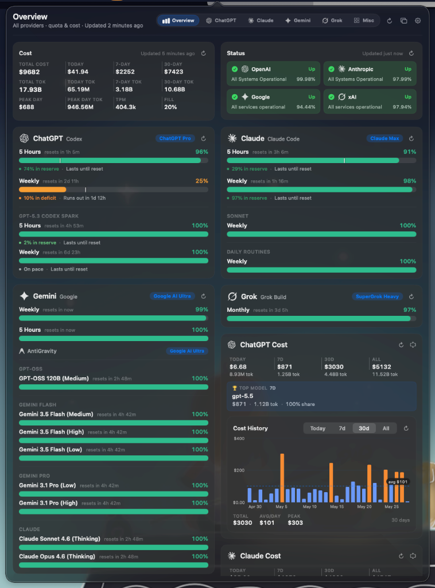
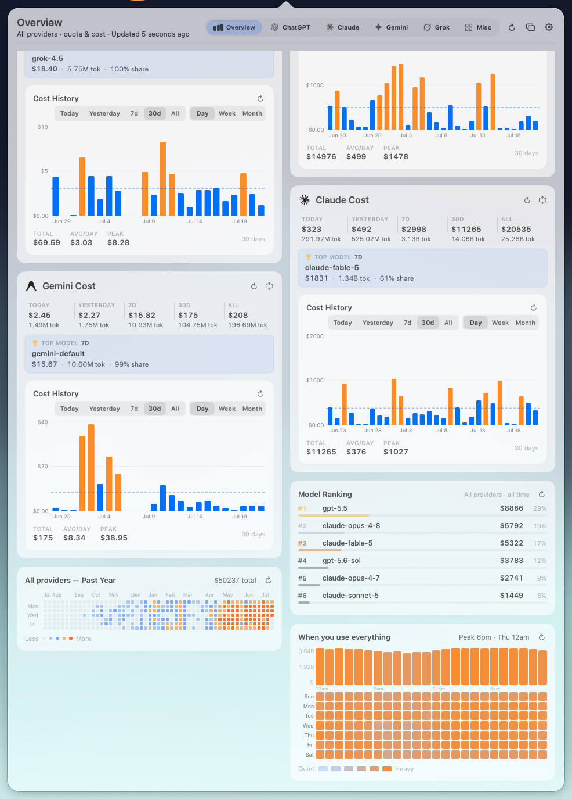
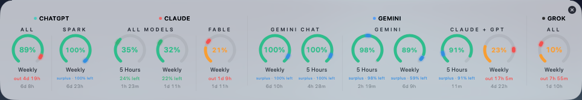
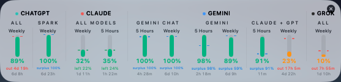
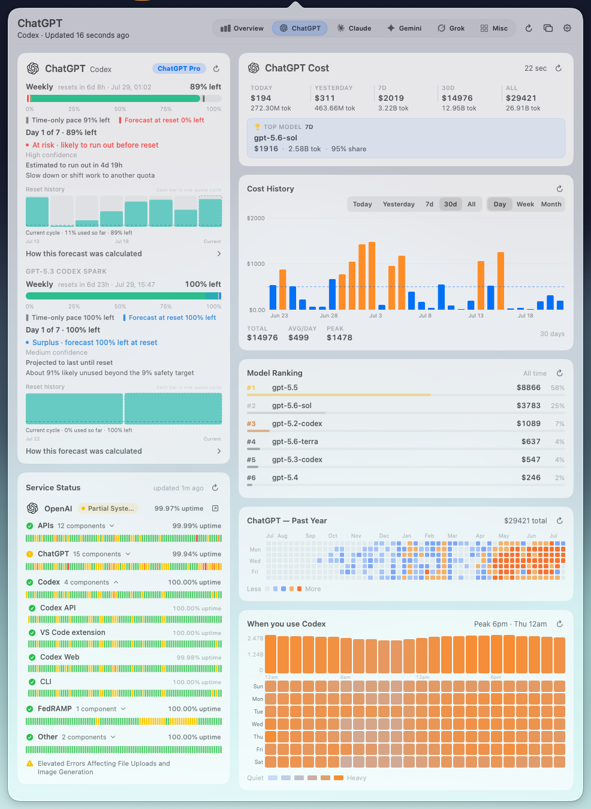
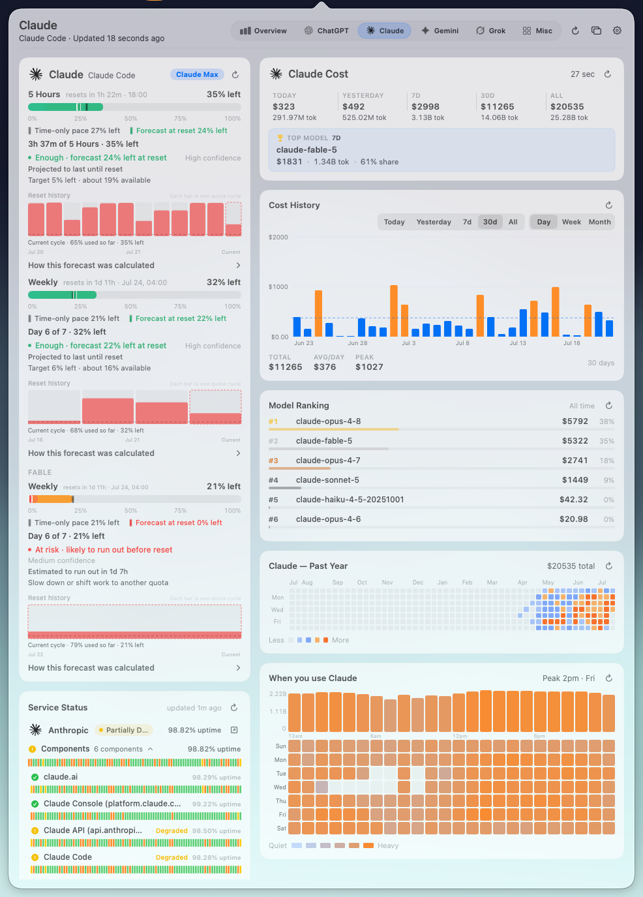
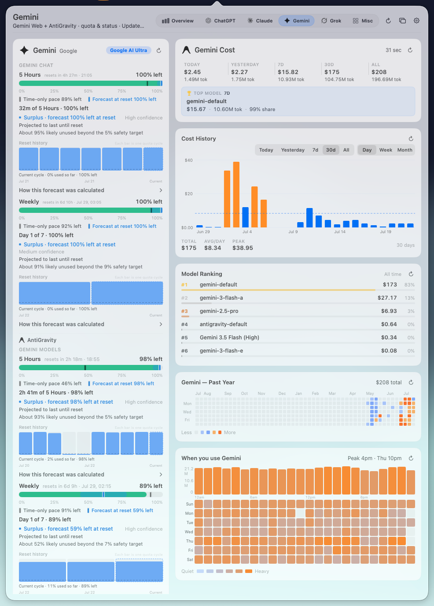
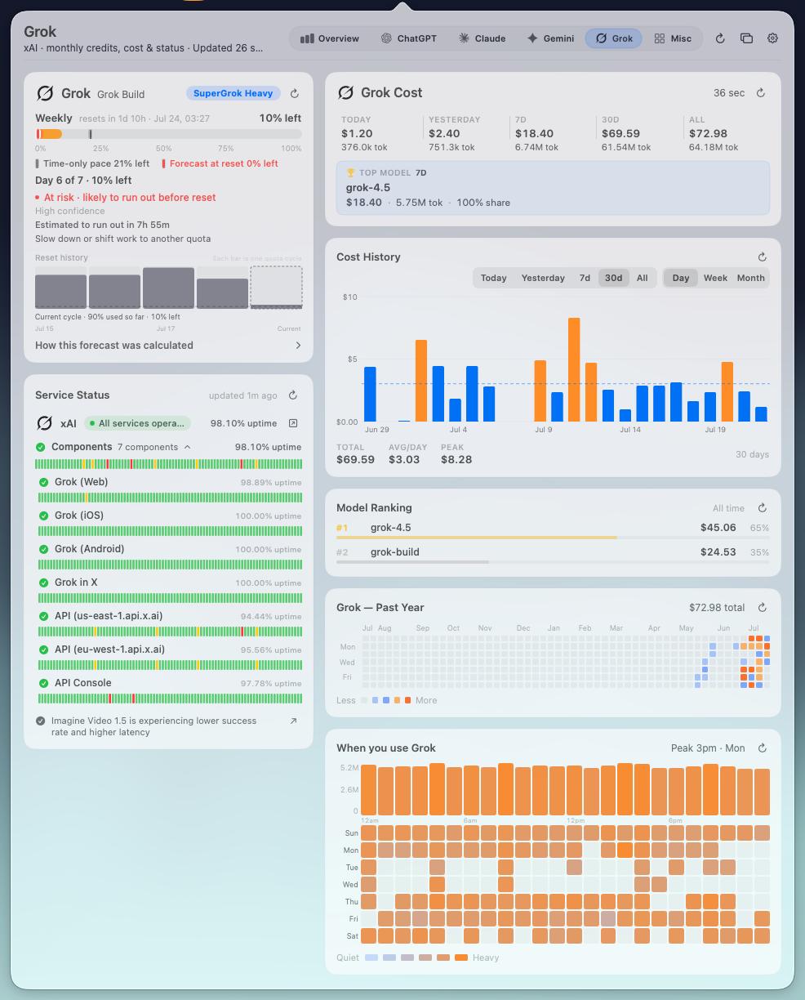
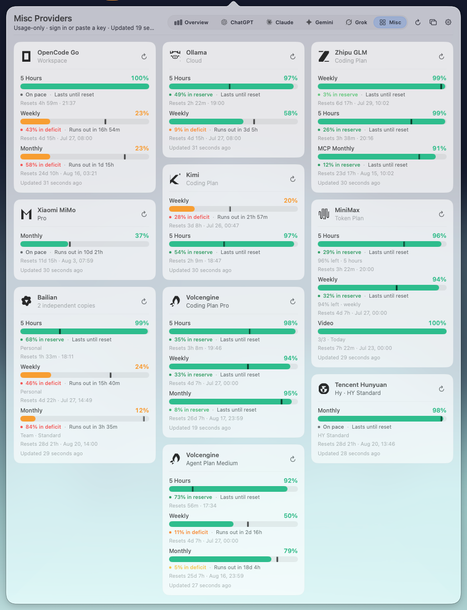
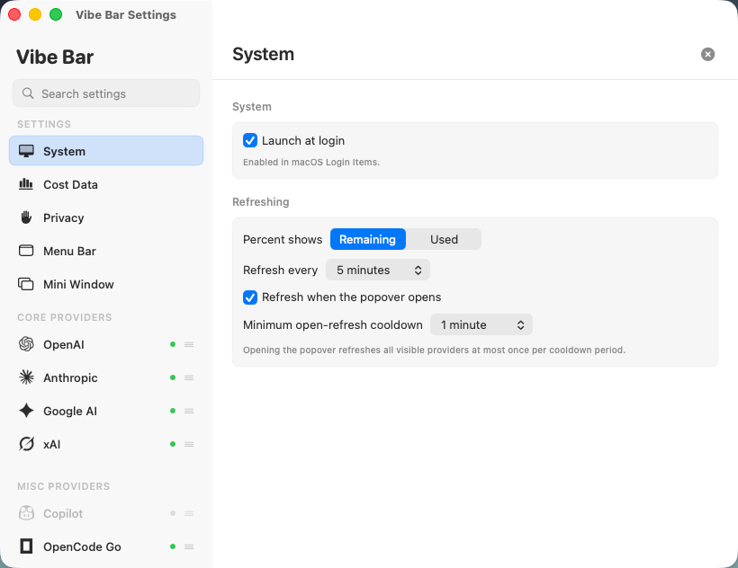

# Vibe Bar

<p align="center">
  
</p>

<p align="center">
  <strong>Know whether your AI subscription will last — and how much you are leaving unused.</strong>
</p>

<p align="center">
  A native macOS menu-bar dashboard for subscription quotas, reset forecasts,<br>
  local token costs, model usage, and provider status.
</p>

<p align="center">
  <a href="https://github.com/AstroQore/vibe-bar/releases/latest"></a>
  
  
  <a href="LICENSE"></a>
</p>

<p align="center">
  <a href="https://github.com/AstroQore/vibe-bar/releases/latest"><strong>Download the latest release</strong></a>
  · <a href="#build-from-source">Build from source</a>
  · <a href="README.zh-CN.md">中文</a>
</p>

<p align="center">
  
</p>

Vibe Bar brings ChatGPT/Codex, Claude Code, Gemini Web, AntiGravity, Grok,
and a growing set of coding-plan providers into one quiet desktop surface.
It answers two questions that raw quota percentages do not:

- **Will this quota last until its next reset?** A personal forecast combines
  wall-clock pace, recent burn, reset history, workday/hour patterns, and
  confidence bounds.
- **Am I paying for quota I never use?** Reset-cycle history makes likely
  pre-reset waste visible before the window disappears.

## At a Glance

- **Reset-aware quota forecasts** — `Learning`, `Enough`, `Watch`, `At risk`,
  `Surplus`, projected run-out time, time-only pace, and forecast confidence.
- **Local cost analytics** — today, yesterday, 7-day, 30-day, and all-time
  spend and tokens, plus per-model ranking.
- **Usage history** — daily/weekly/monthly cost charts, reset-cycle fill
  history, yearly heatmaps, and hour-of-week activity maps.
- **Live provider status** — OpenAI, Anthropic, Google, and xAI incidents and
  component uptime in the same place as quota data.
- **Two floating layouts** — a spacious gauge view and a compact view that
  can stay pinned above your work.
- **End-to-end encrypted remote machines** — outbound-only Linux Probes can
  join selected cost/token totals without giving Relay or Control plaintext.
- **Local-first usage** — no telemetry or hosted plaintext analytics backend;
  the optional account/control service stores workspace/device metadata only.

## One Overview, Not Four Dashboards

Quota, cost, provider status, model ranking, yearly activity, and working-hour
patterns share one set of time ranges instead of living in separate provider
dashboards.

<p align="center">
  
</p>

## Mini Window

Keep every active quota visible on a second display or above a full-screen
workspace. The same quota model is available in two genuinely different
densities.

<p align="center">
  
</p>

<p align="center">
  
</p>

## Provider Deep Dives

Each core provider gets the same layout framework: quota and reset-cycle
history on the left; cost, models, status, yearly activity, and working-hour
patterns on the right.

<table>
  <tr>
    <td width="50%"><br><sub><strong>ChatGPT / Codex</strong> — weekly and Spark quota, cost, model ranking, reset history, and OpenAI status.</sub></td>
    <td width="50%"><br><sub><strong>Claude Code</strong> — 5 Hours, Weekly, Fable, cost analytics, reset history, and Anthropic status.</sub></td>
  </tr>
  <tr>
    <td width="50%"><br><sub><strong>Gemini + AntiGravity</strong> — Gemini Chat and model-family quotas alongside local usage analytics.</sub></td>
    <td width="50%"><br><sub><strong>Grok</strong> — weekly quota, model cost, reset history, xAI status, and activity patterns.</sub></td>
  </tr>
</table>

## Remote Machines

The separate [VibeBar Probe](https://github.com/AstroQore/vibebar-probe) can
observe supported CLI logs on a systemd Linux machine without opening an
inbound port. Probe facts are buffered locally, encrypted to the active Core,
and routed through an opaque Relay. Each remote machine is excluded from totals
until you explicitly enable **Include in totals**; selected usage then joins
this Mac's local snapshots across Overview and the four core cost pages.

See the [Remote Probe guide](https://vibebar.aqor.io/docs/guide/remote-probes)
for binary installation, enrollment, updates, rollback, and the Web/iOS E2EE
freshness model.

## More Coding Plans

The Misc page keeps provider-specific quota semantics intentionally simple and
scannable. Supported integrations include OpenCode Go, Ollama Cloud, Zhipu
GLM, Xiaomi MiMo, Kimi, MiniMax, Alibaba Bailian, Volcengine Coding/Agent
Plans, and Tencent Hunyuan.

<p align="center">
  
</p>

## Settings That Stay Out of the Way

Choose Remaining or Used percentages, refresh on a timer or when the popover
opens, set an open-refresh cooldown, launch at login, and control provider
visibility and ordering from one two-column settings window.

<p align="center">
  
</p>

## What Vibe Bar Reads

| Surface | Quota and status | Cost and activity sources |
| --- | --- | --- |
| ChatGPT / Codex | Codex subscription windows, Spark, OpenAI status | `~/.codex/sessions/**/*.jsonl` |
| Claude Code | 5 Hours, Weekly, Fable, Anthropic status | `~/.claude/projects/**/*.jsonl` |
| Gemini + AntiGravity | Gemini Web quotas and local AntiGravity language-server quotas | Local Gemini/AntiGravity usage records |
| Grok + Cursor Agent | Grok Build quota, Cursor Models, Other Models, Grok Bot weekly quota, xAI status | Local Grok Build records + Cursor account usage events; Grok Bot is quota-only |
| Misc providers | Provider-specific coding/token plan endpoints | Quota-only unless an adapter exposes local usage |

Provider contracts can change without notice. Vibe Bar keeps refresh errors
visible, preserves the last known good snapshot, and avoids presenting stale
data as a successful update.

## Privacy and Local Data

Vibe Bar has no telemetry pipeline or hosted plaintext analytics backend.
Local and remote-Probe usage analysis stays on the active Core. The optional
hosted account/control service stores workspace, enrollment, Relay directory,
and audit metadata only. Derived state stays under:

```text
~/.vibebar/
├── settings.json
├── quotas/
├── cost_snapshots/
├── scan_cache/
├── pricing_sources/
├── pricing_cache.json
├── pricing_refresh_status.json
├── service_status.json
├── remote_core.json
├── remote_usage.sqlite3
└── cost_history.json
```

- CLI credential and session files are read-only inputs. The one exception
  is whole-session deletion from the Workbench's Sessions page, performed
  only at your explicit request and never editing a session file's contents.
- Vibe Bar-owned cookies and provider secrets live inside one versioned
  Keychain Vault, not one prompt-generating item per secret.
- Privacy Mode clears derived cost data and keeps cost history off disk while
  enabled.
- Retention is configurable, and Cost Data can be cleared manually.

Vibe Bar intentionally runs **without the App Sandbox**. Browser-cookie import
and the local AntiGravity language-server probe require capabilities that the
sandbox blocks. The app is open source, reads only the provider inputs it
needs, and writes application state only under `~/.vibebar/` and its Keychain
Vault. See [AGENTS.md](AGENTS.md#6-home-directory-and-why-we-no-longer-sandbox)
for the full trade-off.

## Install

### Download a release

1. Download the Apple-silicon ZIP from
   [GitHub Releases](https://github.com/AstroQore/vibe-bar/releases/latest).
2. Move `Vibe Bar.app` to `/Applications`.
3. Launch it from Applications or Spotlight.

Release builds are ad-hoc signed and currently not notarized. If Gatekeeper
blocks the first launch, right-click the app and choose **Open**. No Apple
Developer account is required to build or run Vibe Bar locally.

Starting with the first Sparkle-enabled release, Vibe Bar checks the signed
update feed once a day. **Settings → System** lets you choose the stable
**Main** channel or the preview **Dev** channel; Dev also receives all Main
releases. You can also choose **Check for Updates…** from a menu-bar item's
context menu or Settings. Vibe Bar always asks before installing an update;
the first Sparkle-enabled release still needs to be installed manually once.

### Build from source

Requirements: macOS 26+, Xcode 26, and Swift 6.2+.

```bash
git clone https://github.com/AstroQore/vibe-bar.git
cd vibe-bar
swift test
./Scripts/build_app.sh release
open ".build/Vibe Bar.app"
```

The package contains the `VibeBar` executable and the testable `VibeBarCore`
library. The packaging script assembles `.build/Vibe Bar.app`, copies its
resources and Sparkle framework, and ad-hoc signs the bundle.

## Contributing

- [CONTRIBUTING.md](CONTRIBUTING.md) — concise human contributor guide.
- [AGENTS.md](AGENTS.md) — complete repository rules for coding agents.
- [AGENT-PR.md](AGENT-PR.md) — branch, verify, push, and open a PR.
- [AGENT-DEPLOY.md](AGENT-DEPLOY.md) — build, package, verify, and optionally
  install on a Mac.
- [SECURITY.md](SECURITY.md) — report vulnerabilities without exposing secrets.

Vibe Bar is early public-release software. Provider APIs and quota contracts
move quickly; focused adapters, fixtures, and UI refinements are welcome.

## Acknowledgements

Vibe Bar is an independent project, but it stands on work shared by the wider
coding-agent community:

- [CodexBar](https://github.com/steipete/CodexBar) is the primary technical
  reference for the macOS menu-bar quota experience. Several browser-cookie
  and Keychain utilities, selected provider behaviors, and the AntiGravity
  local-probe flow were adapted from or reimplemented with reference to it.
- [CC Switch](https://github.com/farion1231/cc-switch) informed the unified
  Skills workflow and remains an interoperability reference for existing
  cross-agent skill layouts.
- [CLIProxyAPI](https://github.com/router-for-me/CLIProxyAPI) and its ecosystem
  informed our understanding of multi-provider CLI account and quota
  workflows. Vibe Bar does not embed, launch, or require CLIProxyAPI.
- [ccusage](https://github.com/ccusage/ccusage) informed local session-cost
  parsing and pricing semantics.
- [LiteLLM](https://github.com/BerriAI/litellm),
  [models.dev](https://github.com/anomalyco/models.dev), and
  [Portkey Models](https://github.com/Portkey-AI/models) maintain the public
  model-pricing catalogs Vibe Bar refreshes and merges for cost attribution.
  [AstroQore VibeBar Model Pricing](https://github.com/AstroQore/vibebar-model-pricing)
  carries the small Vibe Bar-specific supplement layer.

Vibe Bar also directly uses
[SweetCookieKit](https://github.com/steipete/SweetCookieKit) for local browser
cookie access and [Sparkle](https://github.com/sparkle-project/Sparkle) for
signed app updates. See [THIRD_PARTY_NOTICES.md](THIRD_PARTY_NOTICES.md) for
the relationship and license details; complete applicable license texts live
under [Resources/ThirdPartyLicenses](Resources/ThirdPartyLicenses) and are
included in packaged app bundles. These projects are independent from Vibe
Bar; acknowledgement does not imply affiliation or endorsement.

## License

Vibe Bar is licensed under the
[GNU Affero General Public License v3.0 only](LICENSE).

## Star History

<p align="center">
  <a href="https://star-history.com/#AstroQore/vibe-bar&Date">
    
  </a>
</p>
