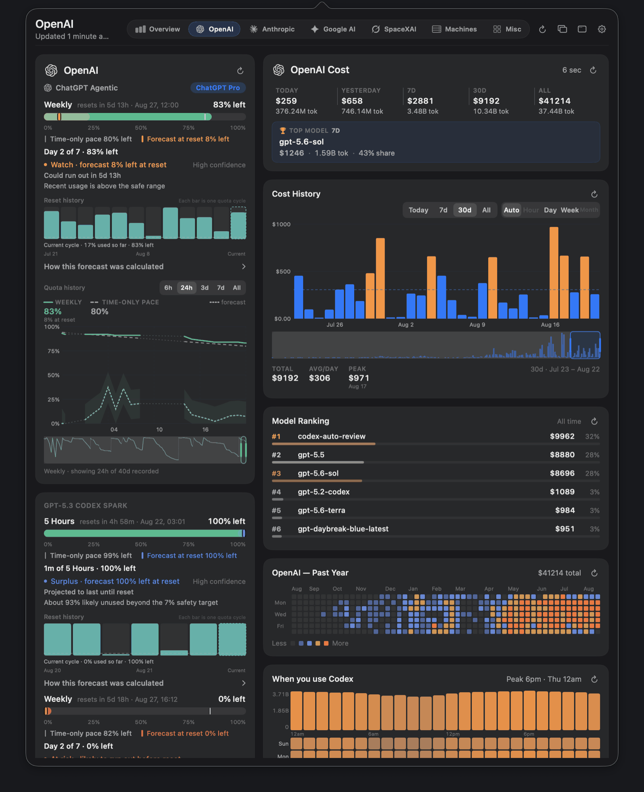
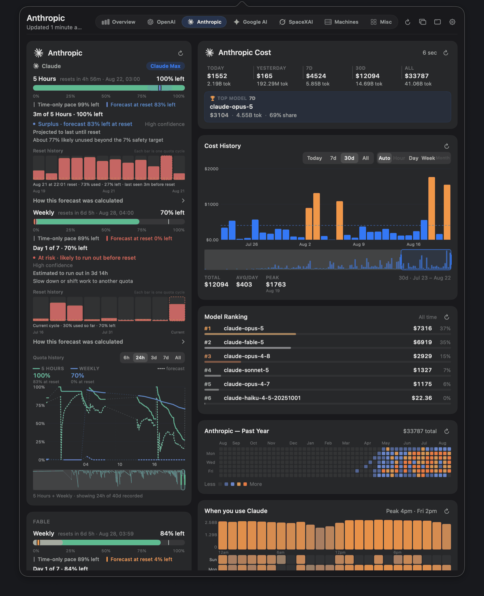
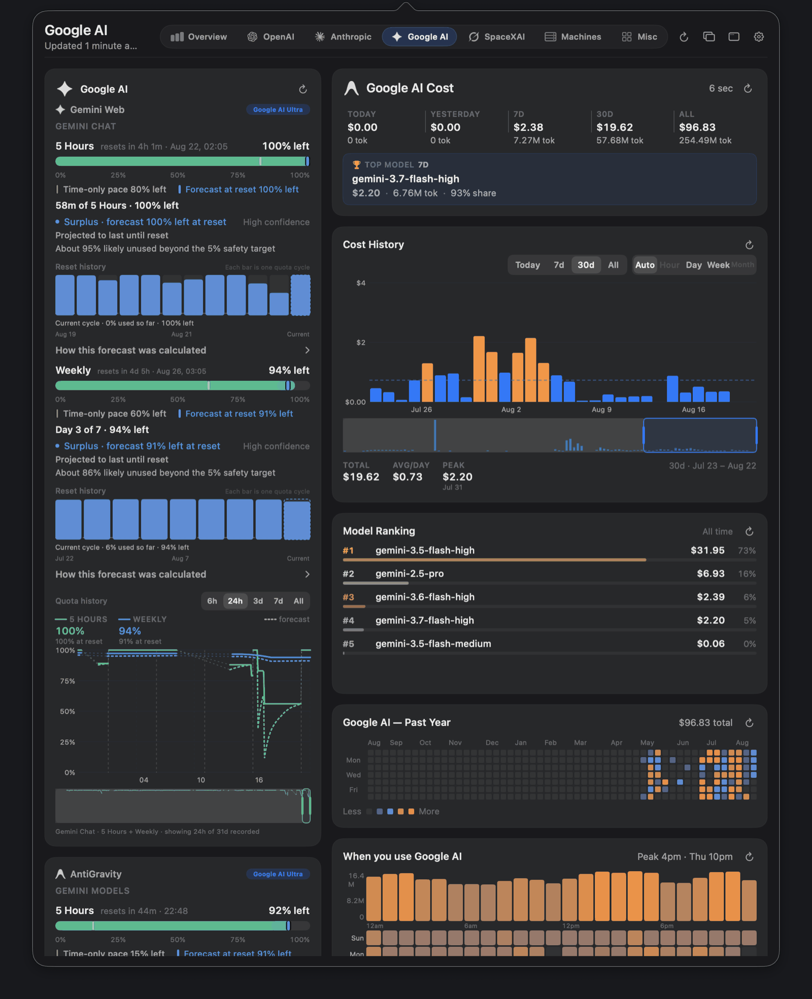
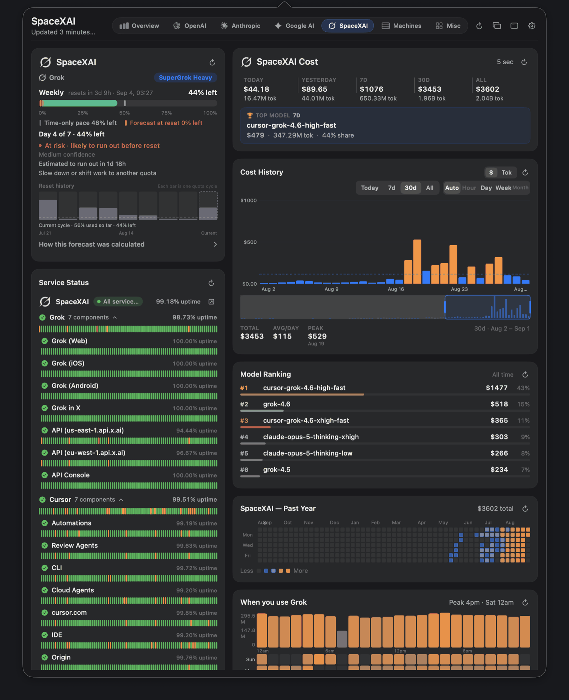
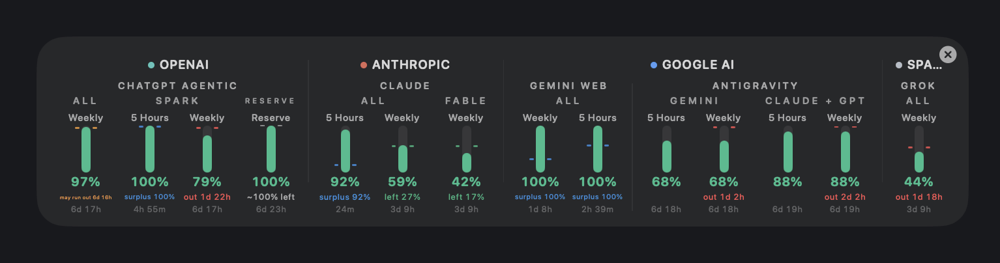
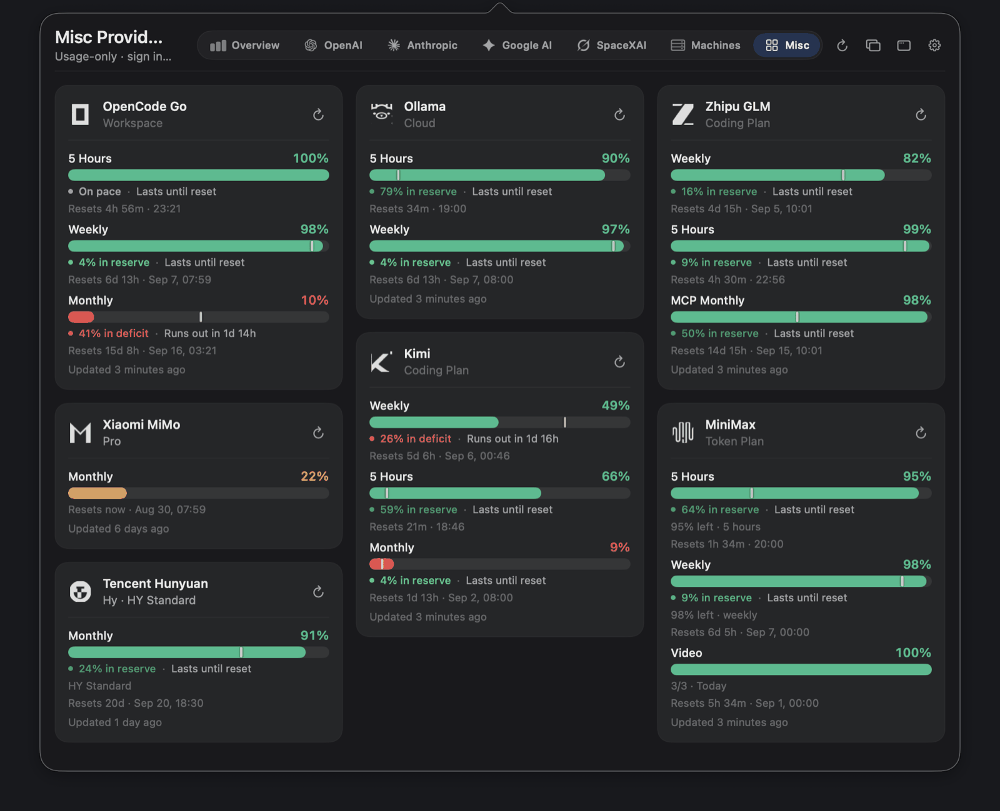
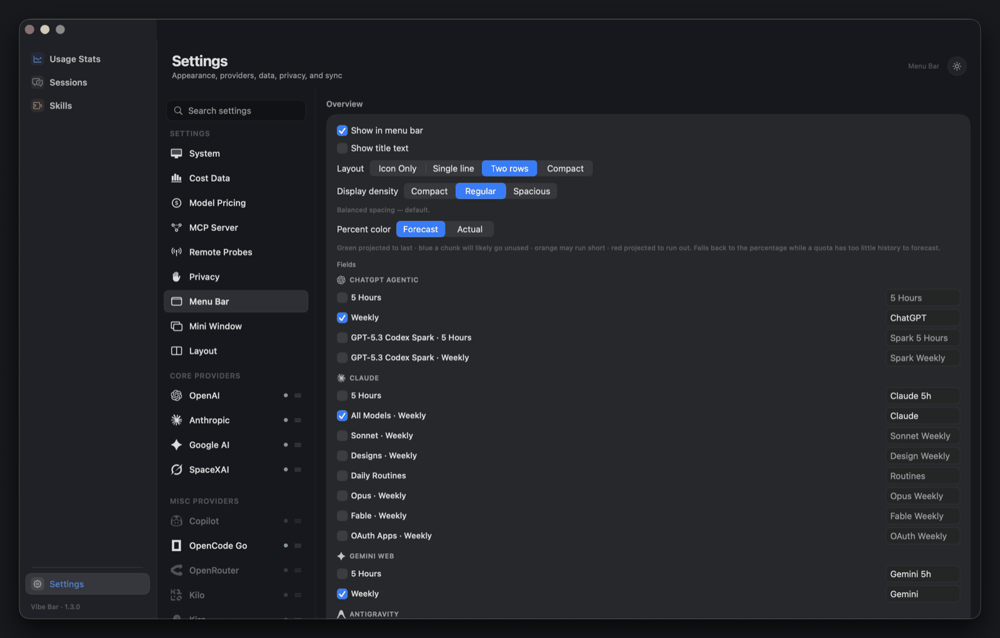
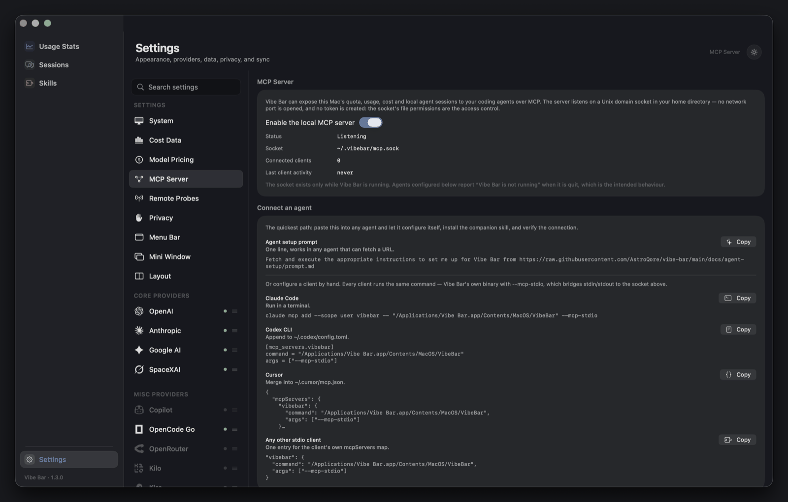
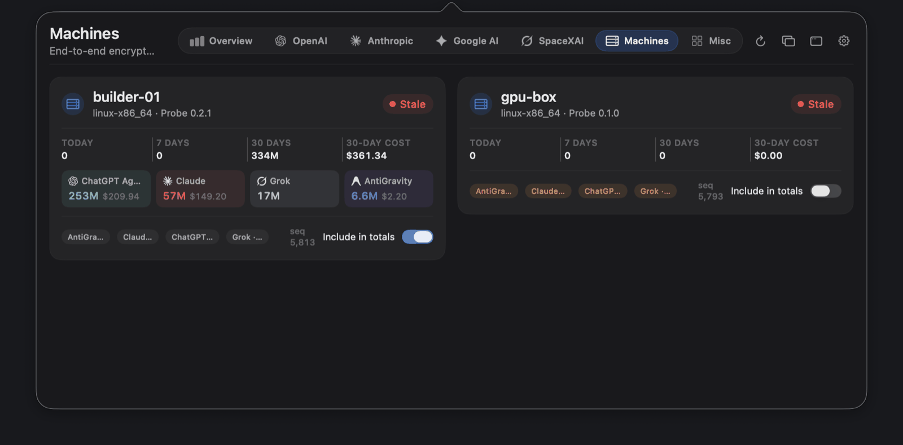
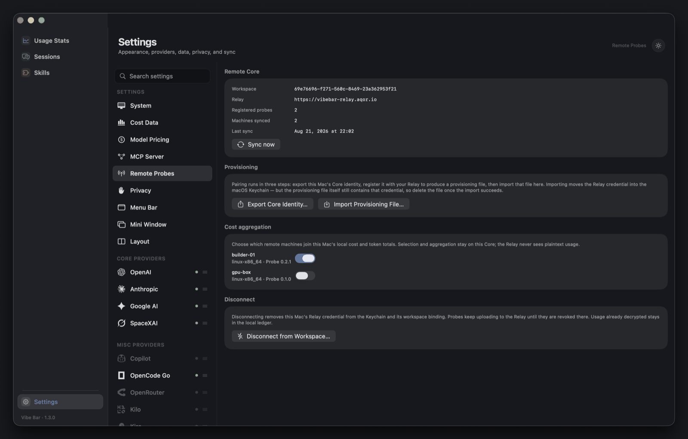

<p align="center">
  
</p>

<h1 align="center">Vibe Bar</h1>

<p align="center">
  <strong>The local capacity control plane for people who run coding agents all day.</strong><br>
  <sub>Know whether each subscription will last until reset — and how much paid capacity will be left unused.</sub>
</p>

<p align="center">
  <a href="https://github.com/AstroQore/vibe-bar/actions/workflows/ci.yml"></a>
  <a href="https://github.com/AstroQore/vibe-bar/releases/latest"></a>
  
  
  <a href="LICENSE"></a>
</p>

<p align="center">
  <a href="https://github.com/AstroQore/vibe-bar/releases/latest"><strong>Download</strong></a>
  · <a href="#why-vibe-bar-is-different">Why Vibe Bar</a>
  · <a href="#build-from-source">Build from source</a>
  · <a href="#agents-mcp">Agents (MCP)</a>
  · <a href="#acknowledgements">Acknowledgements</a>
  · <a href="README.zh-CN.md">中文</a>
</p>

Vibe Bar is a native macOS menu-bar app for subscription-powered coding
agents. It connects provider-reported quota with the evidence already on your
Mac: per-request tokens and cost, completed reset cycles, local sessions,
models, working hours and remote-machine activity.

A quota monitor tells you what is left. A token dashboard tells you what
happened. A session browser finds an old conversation. Vibe Bar keeps that
chain intact, so the same local source of truth can help you plan the next
run, explain the last one and recover its context.

## Why Vibe Bar is different

| The question | Vibe Bar's connected answer |
| --- | --- |
| **Will this quota survive the reset window?** | A personal forecast blends provider quota observations, recent burn, completed reset cycles and your real weekday/hour pattern. It reports `Learning`, `Enough`, `Watch`, `At risk` or `Surplus`, with a confidence band instead of false precision. |
| **Who actually used it?** | Billing capacity and execution are separate axes: Claude Code and Claude Cowork may share one Claude quota, while the per-request ledger still attributes their tokens and cost to the harness that produced them. |
| **Where did the work go?** | The Workbench pairs a per-request ledger of harnesses, models, tokens and cost with a separate full-text session index that opens transcripts and hands a selected session back to its owning CLI. |
| **Can my agents use this context?** | The same quota, forecast, usage, cost, session, status and pricing data is available through a typed MCP server over a local Unix socket — no TCP port and no credential projection. |

Remote Linux probes can join the same cost and activity model without opening
an inbound port; facts are encrypted to this Mac before they pass through the
Relay.

Under the menu bar sits a Workbench: a per-request usage ledger across every
harness, a searchable index of every local agent session with one-click
resume, and a skills manager that reconciles one library across six
agent CLIs. All of it is read from files already on your Mac, and an MCP
server lets your agents ask the same questions.


<details>
<summary>The same Overview in the light appearance</summary>


</details>

## Forecasts, not percentages

Every quota bar carries a verdict — `Learning`, `Enough`, `Watch`,
`At risk` or `Surplus` — plus a projected run-out time and the forecast's
confidence. Consumption is inferred only from provider quota observations;
token history shapes the calendar of when you tend to work, never a made-up
token-to-quota conversion. Recent slope, comparable completed cycles and the
working-hour profile are blended, while observation coverage and freshness
decide how confident the result may be.

The forecast shown at each refresh is retained as history. Provider pages can
therefore compare what Vibe Bar predicted *then* with what actually happened,
instead of recomputing the past with today's knowledge. They also show reset
history as one bar per cycle, the fill curve against a time-only pace line,
and local cost, model ranking, yearly activity and working-hour pattern in the
same layout for every core provider.

<table>
  <tr>
    <td width="50%"><br><sub><strong>OpenAI</strong> — ChatGPT Agentic and GPT-5.3 Codex Spark windows, reset history, quota history, cost, model ranking, and a year of activity.</sub></td>
    <td width="50%"><br><sub><strong>Anthropic</strong> — 5 Hours, Weekly and per-model weekly windows, each with its own forecast and cycle history.</sub></td>
  </tr>
  <tr>
    <td width="50%"><br><sub><strong>Google AI</strong> — Gemini Web quotas and the AntiGravity language-server quotas for Gemini and Claude/GPT models, side by side.</sub></td>
    <td width="50%"><br><sub><strong>SpaceXAI</strong> — Grok Build, Cursor and Grok Bot quotas, with Cursor's account usage folded into the cost side.</sub></td>
  </tr>
</table>

The verdict is only as good as its history, so a freshly added provider says
`Learning` until enough reset cycles have been observed to trust a
projection; the forecast never claims a confidence it does not have.

## Mini window

Every active quota as a gauge that stays above your work — on a second
display, beside a full-screen terminal, wherever you put it. Open as many
mini windows as you like; each has its own display mode, its own field
selection, and its own drag-arranged order. Double-click a window to cycle
through the seven modes: ring gauges, compact bars, a ledger list, a
one-line strip, a tile grid, a single-provider focus view, and a seven-day
reset-timeline rail. Quota buckets a provider ships after this build are
discovered at runtime and become selectable without an update. The surface
is Liquid Glass and follows whatever is behind it.




<details>
<summary>The regular mini window in the light appearance</summary>


</details>

## More coding plans

The Misc page keeps provider-specific quota semantics simple and scannable.
Supported integrations include Copilot, OpenCode Go, Ollama Cloud, OpenRouter,
Kilo, Kiro, Zhipu GLM, Xiaomi MiMo, Kimi, MiniMax, iFlytek Spark, Alibaba
Bailian, Volcengine Coding and Agent Plans, Tencent Hunyuan, Baidu Qianfan and
Warp. Sign in through the app's own WebView, import a browser cookie, or paste
a key — whatever the provider's console offers.



## The Workbench

The popover is for a glance. The Workbench is a window you leave open.
It also keeps two questions deliberately separate: **which subscription owns
the quota** and **which harness produced the request**. That distinction is
why shared billing pools stay readable without flattening Claude Code, Claude
Cowork, Codex, ChatGPT Work and the other clients into one misleading total.

### Usage Stats

A per-request ledger across every harness on the Mac — Claude Code, Claude
Cowork, Codex, ChatGPT Work, Cursor, Grok Build, AntiGravity, Gemini CLI —
with real token counts split into input, output, cache write and cache read,
priced from the same catalog the popover uses. Filter by harness, model and
range; drag the navigator to focus the chart while five simultaneous donut
cards explain Token Flow, Harness, Provider, Project and Model distribution.
The tables keep the full window and include a project ranking.


<details>
<summary>Usage Stats in the light appearance</summary>


</details>

### Sessions

Every local agent session, indexed with full-text search over prompts,
replies and tool calls, grouped by project, filtered by company, harness or
time. Open one and the transcript is beside it, with a find bar and page
controls that stay fast on transcripts with tens of thousands of lines;
**Open** hands the session back to its own CLI (`claude --resume`,
`codex resume`, `grok --resume`, `agy --conversation`).


<details>
<summary>Sessions in the light appearance</summary>


</details>

Deleting a session from here is the one change Vibe Bar ever makes to a
harness's session files, and only at your explicit request — see
[Privacy and local data](#privacy-and-local-data).

### Skills

One shared library at `~/.agents/skills/`, reconciled across Codex, Claude
Code, Gemini CLI, AntiGravity, Grok Build and Cursor. Each row separates the
harness's effective state from Vibe Bar's symlink/copy: native-disabled skills
show a pause badge, while a skill still visible through another compatibility
root shows a link badge instead of a false “off”. Right-click a harness dot to
choose native enable/disable or projection removal. Install from a ZIP, adopt
skills a CLI already has, discover more from a repository, and back up before
anything is replaced.


<details>
<summary>Skills in the light appearance</summary>


</details>

## Settings that stay out of the way

Everything is one two-column window. Three panes are worth a picture:

**Layout** arranges the cards of every popover page — which cards are shown,
which column, which order — with an explicit Visibility menu, per-card eyes,
presets and a live preview, so the Overview can be the four quotas you watch
and nothing else.


<details>
<summary>The Layout editor in the light appearance</summary>


</details>

**Menu Bar** chooses what the menu bar item itself says — icon only, one
line, two rows or compact — which quota windows it shows, and whether the
colour follows the forecast or the raw percentage.



**Menu Bar Health** shows what AppKit requested versus what macOS actually
placed, the status-item/window/menu-bar heights, the Control Center allow-list
audit, and whether alerts were suppressed. It can re-enable monitoring, copy
the narrow repair command, or repair and re-register the status item without
terminating the app's MCP connections. An explicit opt-in can run that same
narrow repair automatically after three consecutive blocked probes.


<details>
<summary>Menu Bar Health in the light appearance</summary>


</details>

**MCP Server** is the agent side of the app, covered next.

## Agents (MCP)

Vibe Bar can answer your coding agent's questions about your own usage. While
the app runs it exposes a read-only MCP server on a Unix domain socket in your
home directory — no network port, no API key — so Claude Code, Codex CLI,
Cursor or any stdio MCP client can ask "how much Claude do I have left?",
"who burned the most tokens this month?" or "find my session about the
parser". The tool surface covers live cached quota and forecasts, usage
summary/trend/request rows, cost history, session search, provider status and
effective model pricing.

Set it up by pasting this into any agent that can fetch a URL:

```
Fetch and execute the appropriate instructions to set me up for Vibe Bar from https://raw.githubusercontent.com/AstroQore/vibe-bar/main/docs/agent-setup/prompt.md
```

Or configure it by hand — every client runs the same command:

```sh
claude mcp add --scope user vibebar -- "/Applications/Vibe Bar.app/Contents/MacOS/VibeBar" --mcp-stdio
```



Everything agents can reach is read-only except an opt-in "refresh my quota"
tool and an opt-in skill installer; credentials are never exposed and emails
are masked. The socket is created `0600` inside the `0700` `~/.vibebar/`,
is never bound to a network interface, and is removed when Vibe Bar quits.

## Remote machines

The separate [VibeBar Probe](https://github.com/AstroQore/vibebar-probe)
watches supported CLI logs on a systemd Linux machine without opening an
inbound port. Facts are buffered locally, encrypted to this Mac's Core, and
routed through an opaque Relay that never sees plaintext. Each machine stays
out of your totals until you switch **Include in totals** on; then its usage
joins this Mac's in the Overview and the cost pages.





See the [Remote Probe guide](https://vibebar.aqor.io/docs/guide/remote-probes)
for installation, enrollment, updates, rollback and the end-to-end encryption
model.

## What Vibe Bar reads

| Surface | Quota and status | Cost and activity |
| --- | --- | --- |
| ChatGPT / Codex | Codex subscription windows, Spark, OpenAI status | `~/.codex/sessions/**/*.jsonl` |
| Claude Code / Cowork | 5 Hours, Weekly, per-model weekly, Anthropic status | `~/.claude/projects/**/*.jsonl`, Claude.app's Cowork transcripts |
| Gemini + AntiGravity | Gemini Web quotas, local AntiGravity language-server quotas | Local Gemini / AntiGravity usage records |
| Grok + Cursor | Grok quota, Cursor Models and Other Models, Grok Bot weekly, SpaceXAI + Cursor status | Local Grok records, Cursor account usage events; Grok Bot is quota-only |
| Misc providers | Each provider's own coding- or token-plan endpoint | Quota-only unless an adapter exposes local usage |

Provider contracts change without notice. Vibe Bar keeps refresh errors
visible, keeps the last known good snapshot, and never presents stale data as
a successful update.

## About the screenshots

Every picture on this page is the real app, launched in its **demo mode**:
the same binary, pointed at a home directory built by
[`Scripts/demo_home.py`](Scripts/demo_home.py). The quota, forecast, cost and
ledger numbers are one maintainer's real usage, copied; everything that would
identify a person — account ids, machine names, paths, sessions, cookies,
Keychain items — is replaced or fabricated, and every refresh that would
leave that directory is switched off. The agent sessions and skills are
written for the occasion. [`Scripts/capture_demo_screenshots.sh`](Scripts/capture_demo_screenshots.sh)
opens each surface in both appearances and captures it over a flat backdrop;
`DemoMode.swift` is the switch.

## One product, two clients

Vibe Bar is a macOS-native app and intends to stay one: the menu bar, the
Liquid Glass Mini Window, and the Workbench are built directly on AppKit and
SwiftUI, not approximated through a web view.

For Windows and Linux there is a second client,
[**Vibe Bar Desktop**](https://github.com/AstroQore/vibe-bar-desktop) — Tauri
and Rust, same product, same data. It reads the same `~/.vibebar` data root on
a Mac where both are installed, so the two never disagree about your quota or
your settings, and it runs standalone on a machine that has never had the
native app.

Desktop is still being built up to this app and carries its own `0.x` version
until it gets there. At parity the two adopt one shared
`MAJOR.MINOR.PATCH` and every feature release ships from both repositories
together. Nothing about that client changes this one: this repository is the
complete implementation and the reference for what parity means.

## Architecture

Vibe Bar is one app built from two SwiftPM targets plus one package of its
own that lives in a separate repository.

| Piece | What it is | Where it lives |
| --- | --- | --- |
| `VibeBarApp` | The menu-bar item, the popover, the Mini Window, the Workbench, Settings. AppKit + SwiftUI. | This repository |
| `VibeBarCore` | Quota, usage, cost, pricing, forecasting, provider adapters, remote sync — everything testable without a window. | This repository |
| [`agent-session-kit`](https://github.com/AstroQore/agent-session-kit) | Reading what the coding agents left on disk: session discovery and parsing per harness, the full-text session index, deletion planning, harness naming, and the local MCP Unix-socket / stdio transport. | Separate public repository |

The kit was extracted from this repository so that the "what did my agents
actually do" half is usable — and auditable — on its own. It knows nothing
about quotas, plans or prices; that vocabulary stays in `VibeBarCore`. It has
no third-party dependencies and is AGPL-3.0-only, same as Vibe Bar.

The kit now ships two implementation lanes: the Swift package this app links,
and a Rust crate that Vibe Bar Desktop links. They are peers rather than a
port — anything both must agree on, such as the session index schema, lives in
the kit's `contracts/` directory with a test on each side, so the two clients
cannot drift into reading the same file differently.

**How a kit release reaches you.** `Package.swift` pins the kit to an exact
tag and SwiftPM links it statically — it is compiled into the executable, not
shipped as a framework you could swap. A new kit release changes nothing on
your Mac until Vibe Bar bumps that pin and ships a build. **Settings › System
› Components** shows the kit version compiled into the build you are running,
with a *Check for kit updates* button; nothing checks at launch or on a
timer.

## Privacy and local data

Vibe Bar has no telemetry pipeline and no hosted plaintext analytics backend.
Local and remote-Probe usage analysis stays on this Mac. The optional hosted
account/control service stores workspace, enrollment, Relay directory and
audit metadata only. Derived state stays under:

```text
~/.vibebar/
├── settings.json
├── quotas/
├── cost_snapshots/
├── scan_cache/
├── pricing_sources/
├── pricing_cache.json
├── service_status.json
├── usage_events.sqlite3
├── session_index.sqlite3
├── remote_core.json
├── remote_usage.sqlite3
├── cost_history.json
└── mcp.sock            (only while the app runs, mode 0600)
```

- CLI credential and session files are read-only inputs. The one exception
  is whole-session deletion from the Workbench's Sessions page, performed
  only at your explicit request and never editing a session file's contents.
- The Skills manager writes to `~/.agents/skills/`, six managed harness skill
  roots, and the narrow native skill fields in Codex/Claude/Gemini/Grok user
  config. Every config patch is backed up under `~/.vibebar/skill_backups/`.
- Vibe Bar-owned cookies and provider secrets live inside one versioned
  Keychain Vault, not one prompt-generating item per secret.
- Privacy Mode clears derived cost data and keeps cost history off disk while
  enabled. Retention is configurable, and Cost Data can be cleared manually.

Vibe Bar intentionally runs **without the App Sandbox**: browser-cookie
import and the local AntiGravity language-server probe require capabilities
the sandbox blocks. The app is open source and reads only the provider inputs
it needs; writes stay under `~/.vibebar/`, the Keychain Vault, and the explicit
Skills allowlist above. See
[AGENTS.md](AGENTS.md#6-home-directory-and-why-we-no-longer-sandbox) for the
full trade-off.

## Install

### Download a release

1. Download the Apple-silicon ZIP from
   [GitHub Releases](https://github.com/AstroQore/vibe-bar/releases/latest).
2. Move `Vibe Bar.app` to `/Applications`.
3. Launch it from Applications or Spotlight.

Release builds are ad-hoc signed and not notarized. If Gatekeeper blocks the
first launch, right-click the app and choose **Open**. No Apple Developer
account is required to build or run Vibe Bar locally.

Installed builds check the signed update feed once a day and always ask
before installing. **Settings › System** chooses between the stable **Main**
channel and the preview **Dev** channel; Dev also receives every Main
release. **Check for Updates…** is in the menu-bar item's context menu and in
Settings.

### Build from source

Requirements: macOS 26+, Xcode 26, Swift 6.2+.

```bash
git clone https://github.com/AstroQore/vibe-bar.git
cd vibe-bar
swift test
./Scripts/build_app.sh release
open ".build/Vibe Bar.app"
```

The package contains the `VibeBar` executable and the testable `VibeBarCore`
library. The packaging script assembles `.build/Vibe Bar.app`, copies its
resources and the Sparkle framework, and ad-hoc signs the bundle.

## Contributing

- [CONTRIBUTING.md](CONTRIBUTING.md) — concise human contributor guide.
- [AGENTS.md](AGENTS.md) — complete repository rules for coding agents.
- [AGENT-PR.md](AGENT-PR.md) — branch, verify, push, and open a PR.
- [AGENT-DEPLOY.md](AGENT-DEPLOY.md) — build, package, verify, and optionally
  install on a Mac.
- [SECURITY.md](SECURITY.md) — report vulnerabilities without exposing secrets.

Provider APIs and quota contracts move quickly; focused adapters, fixtures
and UI refinements are welcome.

## Acknowledgements

Vibe Bar is an independent project, but it stands on work shared by the wider
coding-agent community:

- [CodexBar](https://github.com/steipete/CodexBar) is the primary technical
  reference for the macOS menu-bar quota experience. Several browser-cookie
  and Keychain utilities, selected provider behaviors, and the AntiGravity
  local-probe flow were adapted from or reimplemented with reference to it.
- [CC Switch](https://github.com/farion1231/cc-switch) informed the unified
  Skills workflow and remains an interoperability reference for existing
  cross-agent skill layouts.
- [CodexBar compatibility notes](docs/CODEXBAR-COMPATIBILITY.md) record the
  provider migration boundary, the read-only bridge, and what its CLI does.
- [CLIProxyAPI](https://github.com/router-for-me/CLIProxyAPI) and its ecosystem
  informed our understanding of multi-provider CLI account and quota
  workflows. Vibe Bar does not embed, launch, or require CLIProxyAPI.
- [ccusage](https://github.com/ccusage/ccusage) informed local session-cost
  parsing and pricing semantics.
- [LiteLLM](https://github.com/BerriAI/litellm),
  [models.dev](https://github.com/anomalyco/models.dev), and
  [Portkey Models](https://github.com/Portkey-AI/models) maintain the public
  model-pricing catalogs Vibe Bar refreshes and merges for cost attribution.
  [AstroQore VibeBar Model Pricing](https://github.com/AstroQore/vibebar-model-pricing)
  carries the small Vibe Bar-specific supplement layer.

Vibe Bar also directly uses
[SweetCookieKit](https://github.com/steipete/SweetCookieKit) for local browser
cookie access and [Sparkle](https://github.com/sparkle-project/Sparkle) for
signed app updates. See [THIRD_PARTY_NOTICES.md](THIRD_PARTY_NOTICES.md) for
the relationship and license details; complete applicable license texts live
under [Resources/ThirdPartyLicenses](Resources/ThirdPartyLicenses) and are
included in packaged app bundles. These projects are independent from Vibe
Bar; acknowledgement does not imply affiliation or endorsement.

## License

Vibe Bar is licensed under the
[GNU Affero General Public License v3.0 only](LICENSE).

## Star History

<p align="center">
  <a href="https://star-history.com/#AstroQore/vibe-bar&Date">
    
  </a>
</p>
