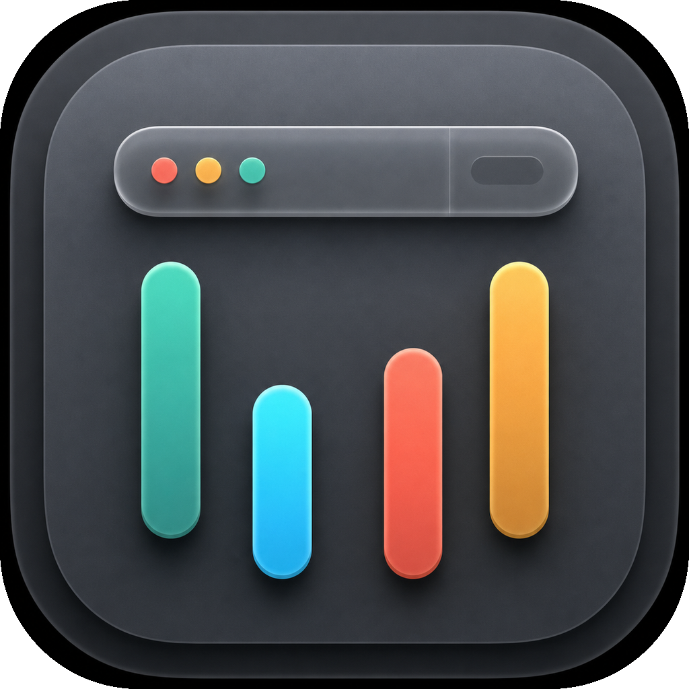
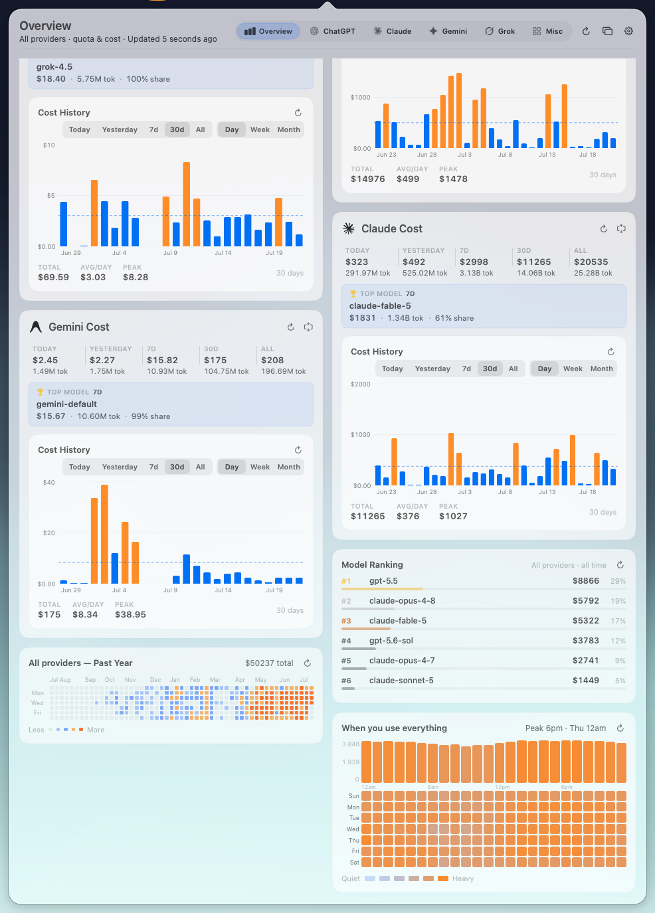
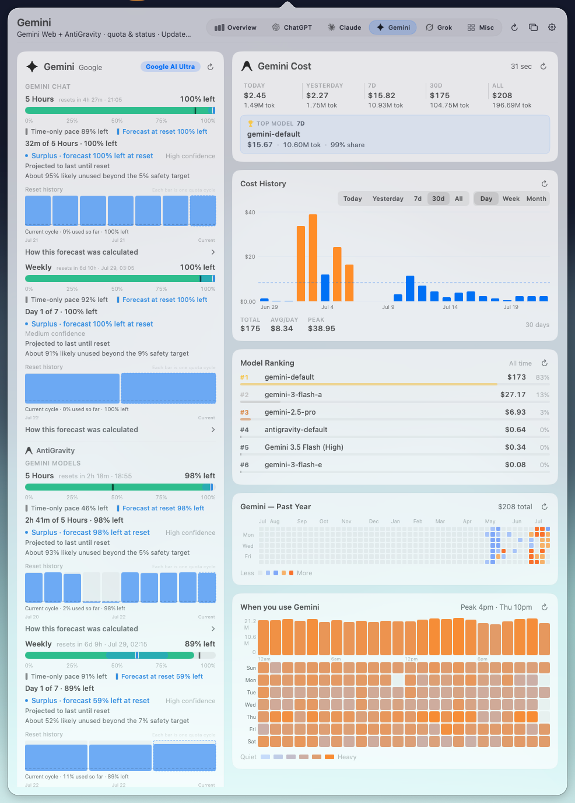
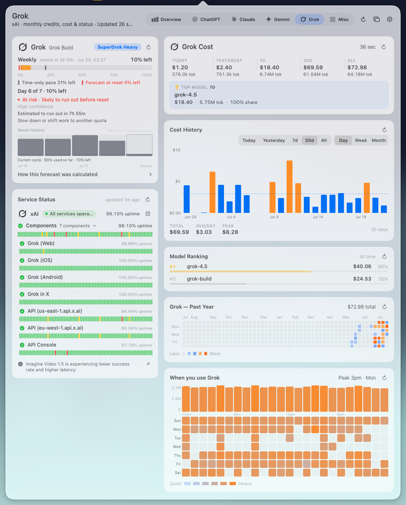
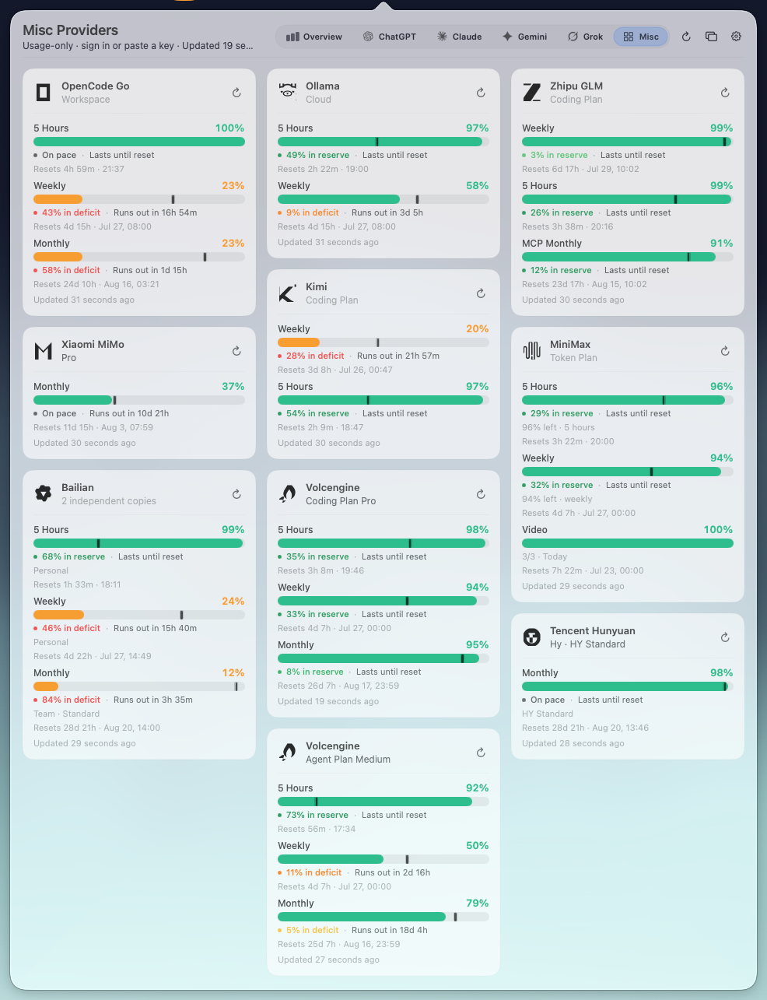
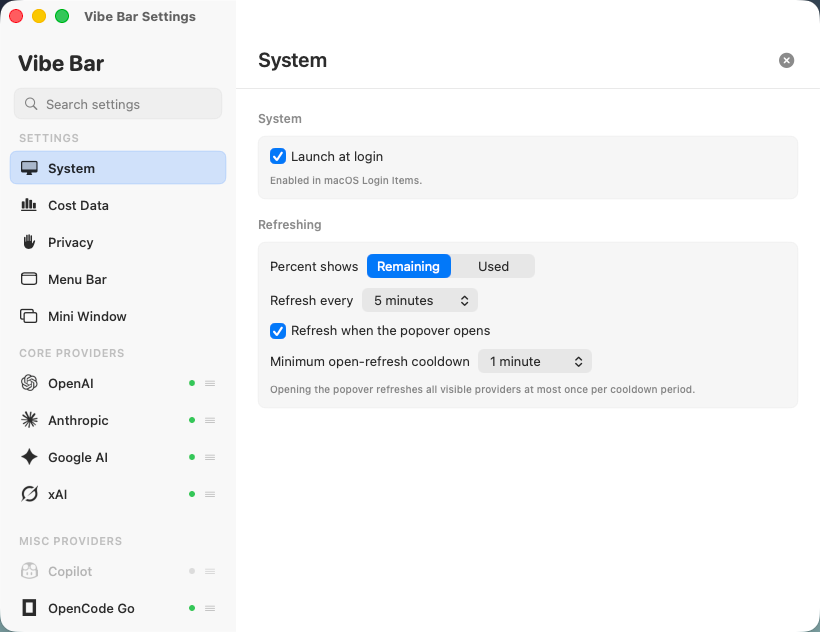

# Vibe Bar

<p align="center">
  
</p>

<p align="center">
  <strong>不只告诉你还剩多少，还告诉你够不够用、会不会浪费。</strong>
</p>

<p align="center">
  一款原生 macOS 菜单栏仪表盘，统一查看订阅配额、重置预测、<br>
  本地 Token 成本、模型用量与服务状态。
</p>

<p align="center">
  <a href="https://github.com/AstroQore/vibe-bar/releases/latest"></a>
  
  
  <a href="LICENSE"></a>
</p>

<p align="center">
  <a href="https://github.com/AstroQore/vibe-bar/releases/latest"><strong>下载最新版本</strong></a>
  · <a href="#从源码构建">从源码构建</a>
  · <a href="README.md">English</a>
</p>

<p align="center">
  
</p>

Vibe Bar 把 ChatGPT/Codex、Claude Code、Gemini Web、AntiGravity、Grok
以及不断增加的 Coding Plan 服务商收进一个安静的桌面入口。它要回答的是
单纯百分比回答不了的两个问题：

- **这份额度能不能撑到下一次重置？** 个性化预测会综合纯时间节奏、近期消耗、
  历史重置周期、工作日/小时习惯以及置信区间。
- **我是不是一直在浪费没有用完的订阅？** Reset History 会在当前周期结束前，
  直观显示过去每次重置前还剩多少。

## 一眼能看到什么

- **面向重置的额度预测** —— `Learning`、`Enough`、`Watch`、`At risk`、
  `Surplus`，预计用完时间、纯时间 Pace 与预测置信区间。
- **本地成本分析** —— Today、Yesterday、7 天、30 天和 All-time 的成本、
  Token 以及模型排行。
- **使用历史** —— 按日/周/月查看成本，按重置周期查看利用率，再配合年度热力图
  和一周 168 小时使用分布。
- **服务状态** —— OpenAI、Anthropic、Google、xAI 的事故信息、组件状态与
  Uptime 和额度放在同一个界面。
- **两种迷你浮窗** —— 真正不同的信息密度，可固定在第二块屏幕或全屏工作区上方。
- **本地优先** —— 没有 Vibe Bar 账号、遥测系统或托管分析后端。

## 一个 Overview，而不是四个网页

额度、成本、Provider 状态、模型排行、年度用量与工作时段使用同一套坐标和
时间范围；不用再分别打开多个厂商 Dashboard 对数字。

<p align="center">
  
</p>

## 迷你浮窗

把全部有效额度固定在第二块屏幕，或悬浮在全屏工作区上方。Regular 与 Compact
使用同一份额度模型，但针对两种场景做了真正不同的排版。

<p align="center">
  
</p>

<p align="center">
  
</p>

## 四大 Provider 深度页面

四个核心 Provider 共用同一套页面框架：左侧是额度、预测和重置历史；右侧是
成本、模型、服务状态、年度活动和工作时段。

<table>
  <tr>
    <td width="50%"><br><sub><strong>ChatGPT / Codex</strong> —— Weekly、Spark、成本、模型排行、重置历史和 OpenAI 状态。</sub></td>
    <td width="50%"><br><sub><strong>Claude Code</strong> —— 5 Hours、Weekly、Fable、成本分析、重置历史和 Anthropic 状态。</sub></td>
  </tr>
  <tr>
    <td width="50%"><br><sub><strong>Gemini + AntiGravity</strong> —— Gemini Chat 与模型族额度，并列展示本地用量分析。</sub></td>
    <td width="50%"><br><sub><strong>Grok</strong> —— Weekly 额度、模型成本、重置历史、xAI 状态与使用习惯。</sub></td>
  </tr>
</table>

## 更多 Coding Plan

Misc 页面保留各服务商原本的额度语义，同时统一成容易扫读的卡片。现有集成包括
OpenCode Go、Ollama Cloud、智谱 GLM、小米 MiMo、Kimi、MiniMax、阿里百炼、
火山引擎 Coding/Agent Plan 和腾讯混元。

<p align="center">
  
</p>

## 不打扰工作的设置

在同一个左右分栏窗口中切换 Remaining/Used、定时刷新或打开 Popover 时刷新、
设置 Open-refresh 冷却、启用开机启动，并控制 Provider 的显隐与排序。

<p align="center">
  
</p>

## Vibe Bar 会读取什么

| 页面 | 配额与状态 | 本地成本与活动 |
| --- | --- | --- |
| ChatGPT / Codex | Codex 订阅窗口、Spark、OpenAI 状态 | `~/.codex/sessions/**/*.jsonl` |
| Claude Code | 5 Hours、Weekly、Fable、Anthropic 状态 | `~/.claude/projects/**/*.jsonl` |
| Gemini + AntiGravity | Gemini Web 配额与本地 AntiGravity Language Server 配额 | 本地 Gemini/AntiGravity 用量记录 |
| Grok | Grok 订阅额度与 xAI 状态 | 本地 Grok Build 用量记录 |
| Misc Providers | 各服务商自己的 Coding/Token Plan 接口 | 除非 Adapter 能取得本地用量，否则仅显示额度 |

服务商的私有接口随时可能变化。Vibe Bar 会明确显示刷新错误，保留上一次成功
快照，并避免把陈旧数据伪装成一次成功更新。

## 隐私与本地数据

Vibe Bar 没有账号系统、遥测管线或托管分析后端。衍生数据只保存在：

```text
~/.vibebar/
├── settings.json
├── quotas/
├── cost_snapshots/
├── scan_cache/
├── service_status.json
└── cost_history.json
```

- CLI 凭据和 Session 文件只读，不会被 Vibe Bar 修改。
- Vibe Bar 自己持有的 Cookie 与 Provider Secret 统一放在一个版本化 Keychain
  Vault 中，不再为每个 Secret 建一个反复弹窗的 Keychain Item。
- Privacy Mode 会清理衍生成本数据，并在启用期间停止把成本历史写入磁盘。
- 保留期限可配置，也可以在 Cost Data 中手动清除全部成本数据。

Vibe Bar **有意不启用 App Sandbox**。浏览器 Cookie 导入和本地 AntiGravity
Language Server 探测需要沙箱会阻止的能力。应用完全开源，只读取 Provider
集成所需的输入，并且仅向 `~/.vibebar/` 与自己的 Keychain Vault 写入状态。
完整取舍见 [AGENTS.md](AGENTS.md#6-home-directory-and-why-we-no-longer-sandbox)。

## 安装

### 下载 Release

1. 从 [GitHub Releases](https://github.com/AstroQore/vibe-bar/releases/latest)
   下载 Apple Silicon ZIP。
2. 把 `Vibe Bar.app` 移到 `/Applications`。
3. 从「应用程序」或 Spotlight 启动。

当前 Release 使用 ad-hoc 签名，尚未做 Apple Notarization。如果 Gatekeeper
拦截首次启动，请右键应用并选择**打开**。在本机构建和运行 Vibe Bar 不需要
Apple Developer 账号。

### 从源码构建

需要 macOS 26+、Xcode 26 和 Swift 6.2+。

```bash
git clone https://github.com/AstroQore/vibe-bar.git
cd vibe-bar
swift test
./Scripts/build_app.sh release
open ".build/Vibe Bar.app"
```

Swift Package 包含 `VibeBar` 可执行目标和可测试的 `VibeBarCore` 库。打包脚本会
生成 `.build/Vibe Bar.app`、复制资源并对 Bundle 做 ad-hoc 签名。

## 参与贡献

- [CONTRIBUTING.md](CONTRIBUTING.md) —— 面向人类贡献者的精简说明。
- [AGENTS.md](AGENTS.md) —— 面向 Coding Agent 的完整仓库规范。
- [AGENT-PR.md](AGENT-PR.md) —— 建分支、校验、推送并创建 PR。
- [AGENT-DEPLOY.md](AGENT-DEPLOY.md) —— 构建、打包、验证，以及可选的本机安装。
- [SECURITY.md](SECURITY.md) —— 在不暴露 Secret 的前提下报告安全问题。

Vibe Bar 仍处于早期公开版本。Provider API 和配额协议变化很快，欢迎提交聚焦的
Adapter、Fixture 与界面优化。

## 许可证

Vibe Bar 采用 [GNU Affero General Public License v3.0 only](LICENSE)。

## Star 历史

<p align="center">
  <a href="https://star-history.com/#AstroQore/vibe-bar&Date">
    
  </a>
</p>
