<p align="center">
  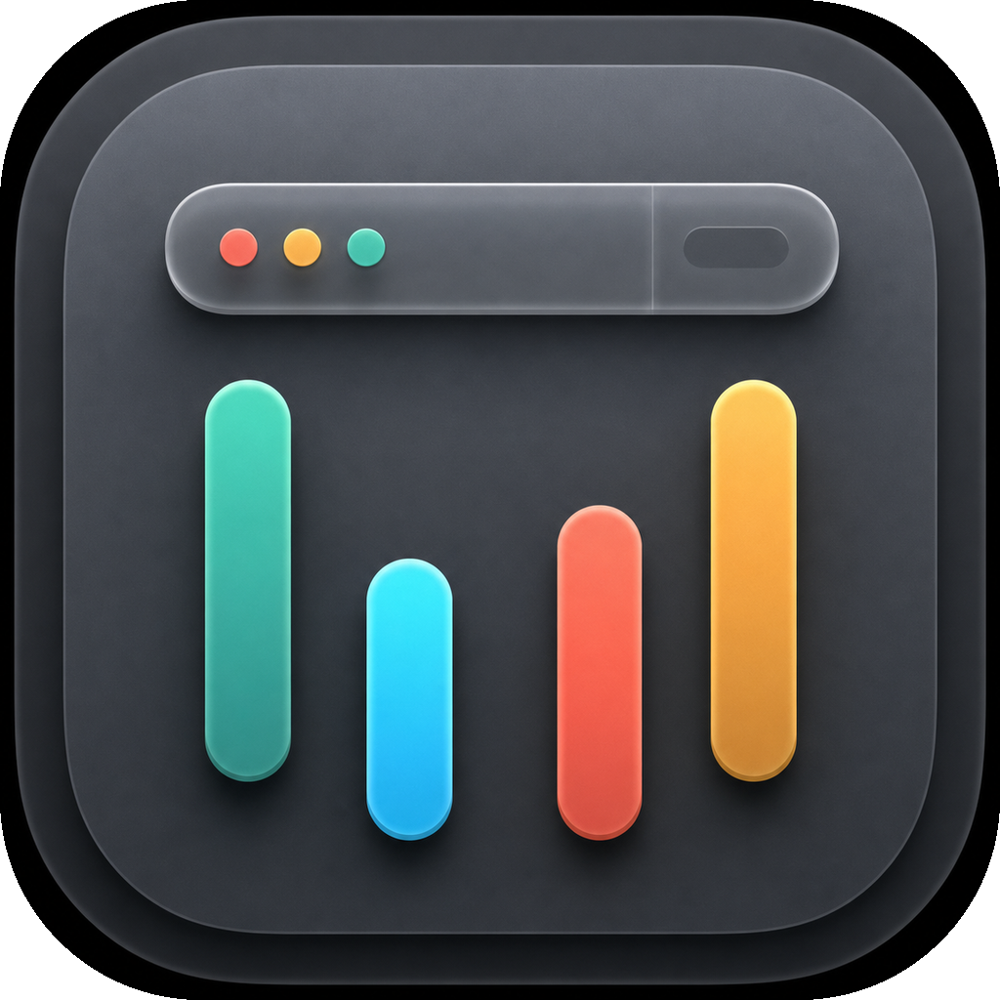
</p>

<h1 align="center">Vibe Bar</h1>

<p align="center">
  <strong>给整天运行编程 Agent 的人准备的本地 AI 容量控制面。</strong><br>
  <sub>提前知道每份订阅能不能撑到重置，以及会有多少付费容量用不完。</sub>
</p>

<p align="center">
  <a href="https://github.com/AstroQore/vibe-bar/actions/workflows/ci.yml"></a>
  <a href="https://github.com/AstroQore/vibe-bar/releases/latest"></a>
  
  
  <a href="LICENSE"></a>
</p>

<p align="center">
  <a href="https://github.com/AstroQore/vibe-bar/releases/latest"><strong>下载</strong></a>
  · <a href="#vibe-bar-的不同之处">为什么是 Vibe Bar</a>
  · <a href="#从源码构建">从源码构建</a>
  · <a href="#agent-接入mcp">Agent 接入（MCP）</a>
  · <a href="#致谢">致谢</a>
  · <a href="README.md">English</a>
</p>

Vibe Bar 是一款面向订阅制编程 Agent 的原生 macOS 菜单栏应用。它把服务商报告的
quota，和你 Mac 上已经存在的证据连起来：逐请求 Token 与成本、已完成的重置周期、
本地会话、模型、工作时段，以及远端机器活动。

Quota Monitor 告诉你还剩多少；Token Dashboard 告诉你发生了什么；Session Browser
帮你找到旧会话。Vibe Bar 保留了这整条链，所以同一份本地数据既能规划下一次运行，
也能解释上一次消耗，还能把当时的上下文找回来。

## Vibe Bar 的不同之处

| 你真正想问的 | Vibe Bar 连起来的答案 |
| --- | --- |
| **这份额度能撑过当前重置窗口吗？** | 个性化预测综合服务商 quota 观测、近期消耗、已完成重置周期和你真实的星期/小时工作模式，给出 `Learning`、`Enough`、`Watch`、`At risk` 或 `Surplus`，并带置信区间，不制造虚假的精确。 |
| **到底是谁消耗了它？** | 订阅容量与执行入口是两条独立轴：Claude Code 和 Claude Cowork 可以共用同一份 Claude quota，但逐请求账本仍把 Token 与成本归给真正发出请求的 harness。 |
| **这些工作后来去了哪里？** | Workbench 并列提供按 harness、模型、Token 与成本拆分的逐请求账本，以及独立的全文会话索引；后者可以打开 transcript，并把选中的会话交还给原本的 CLI。 |
| **我的 Agent 能直接使用这些信息吗？** | 同一份 quota、预测、用量、成本、会话、状态和价格数据通过带类型约束的 MCP 服务提供，走本地 Unix socket——不开 TCP 端口，也不投射凭据。 |

远端 Linux Probe 也能加入同一套成本与活动模型，不需要开放入站端口；事实在经过
Relay 之前就已经加密给这台 Mac。

菜单栏之下还有一个 Workbench：覆盖所有 harness 的逐请求用量账本、可全文搜索并
一键恢复的本地 Agent 会话索引，以及一个把同一份 Skill 库对账到六个 Agent CLI 的
Skills 管理器。所有这些都只读取你 Mac 上已有的文件；还有一个 MCP 服务，让你的
Agent 也能来问同样的问题。

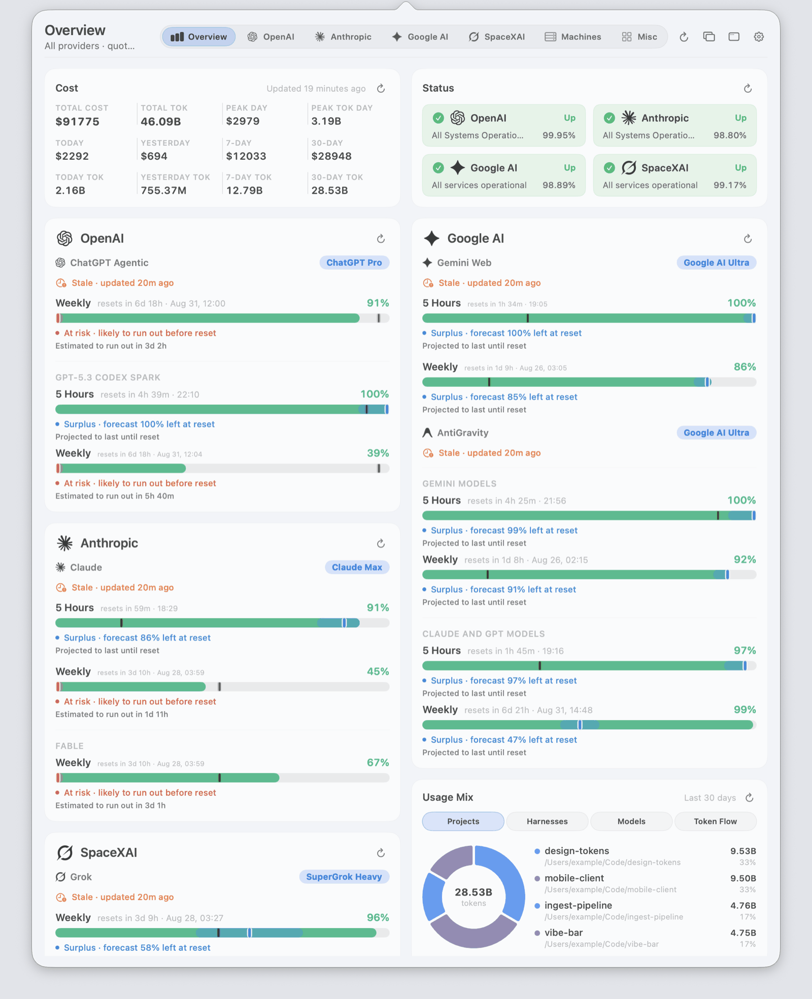

<details>
<summary>深色外观下的同一个 Overview</summary>

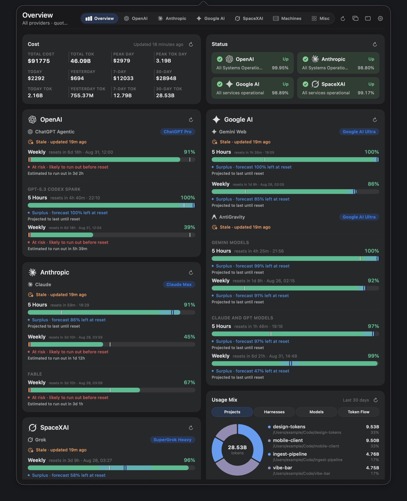

</details>

## 是预测，不是百分比

每条额度进度条都带着一个判断——`Learning`、`Enough`、`Watch`、`At risk` 或
`Surplus`——以及预计用完时间和预测的置信度。消耗速度只从服务商的 quota 观测里
推断；Token 历史只负责描述你通常在什么时间工作，绝不会编造 Token 到 quota 的
换算。近期斜率、可比较的已完成周期和工作时段模式共同参与预测，观测覆盖率与新鲜度
则决定它最多能有多自信。

每次刷新时真正展示过的预测也会被保留下来。服务商页面因此可以比较「当时预测了
什么」和「后来实际发生了什么」，而不是拿今天已经知道的结果重新计算历史。页面还会
展示按周期一根柱的重置历史、对照纯时间 Pace 线的消耗曲线，以及本地成本、模型排行、
年度活动和工作时段分布；四个核心服务商共用同一套版式。

<table>
  <tr>
    <td width="50%">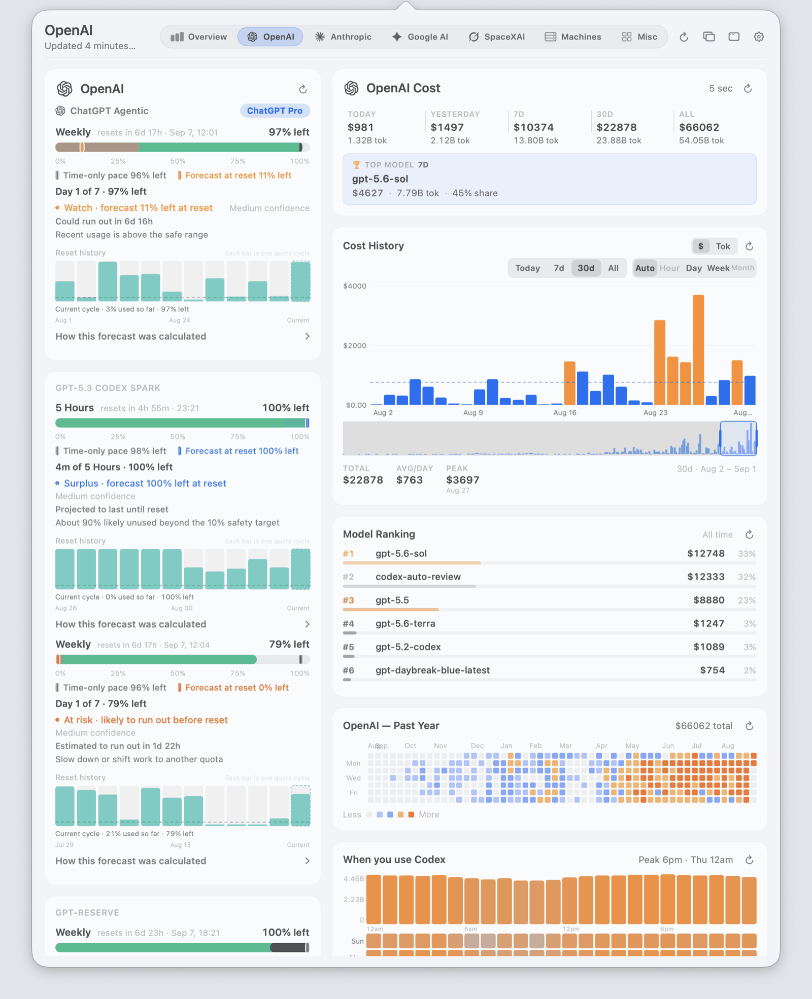<br><sub><strong>OpenAI</strong> —— ChatGPT Agentic 与 GPT-5.3 Codex Spark 窗口、重置历史、额度历史、成本、模型排行和一整年的活动。</sub></td>
    <td width="50%">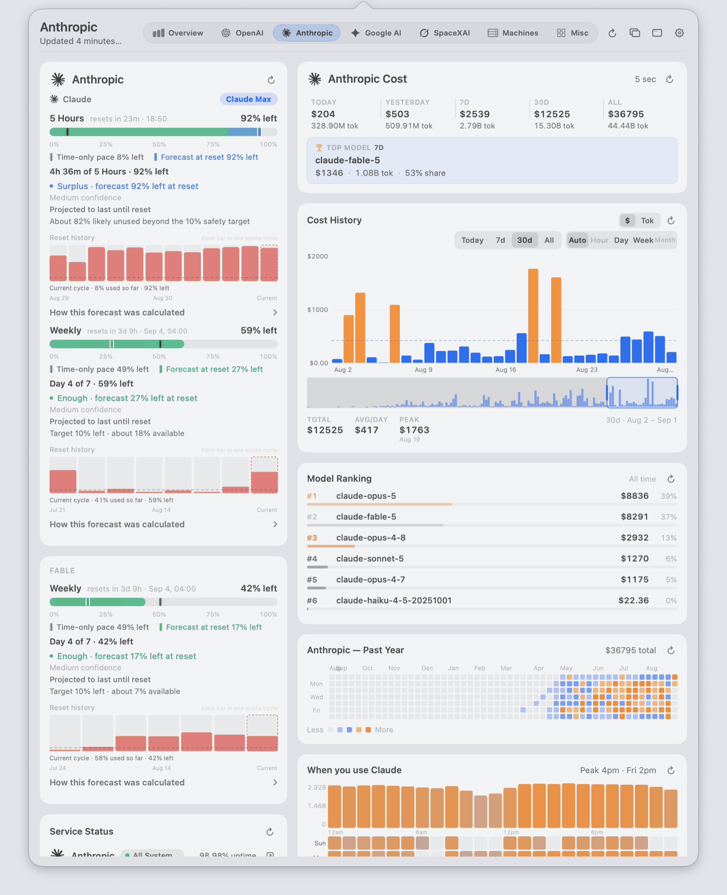<br><sub><strong>Anthropic</strong> —— 5 Hours、Weekly 和按模型的周窗口，各有各的预测与周期历史。</sub></td>
  </tr>
  <tr>
    <td width="50%">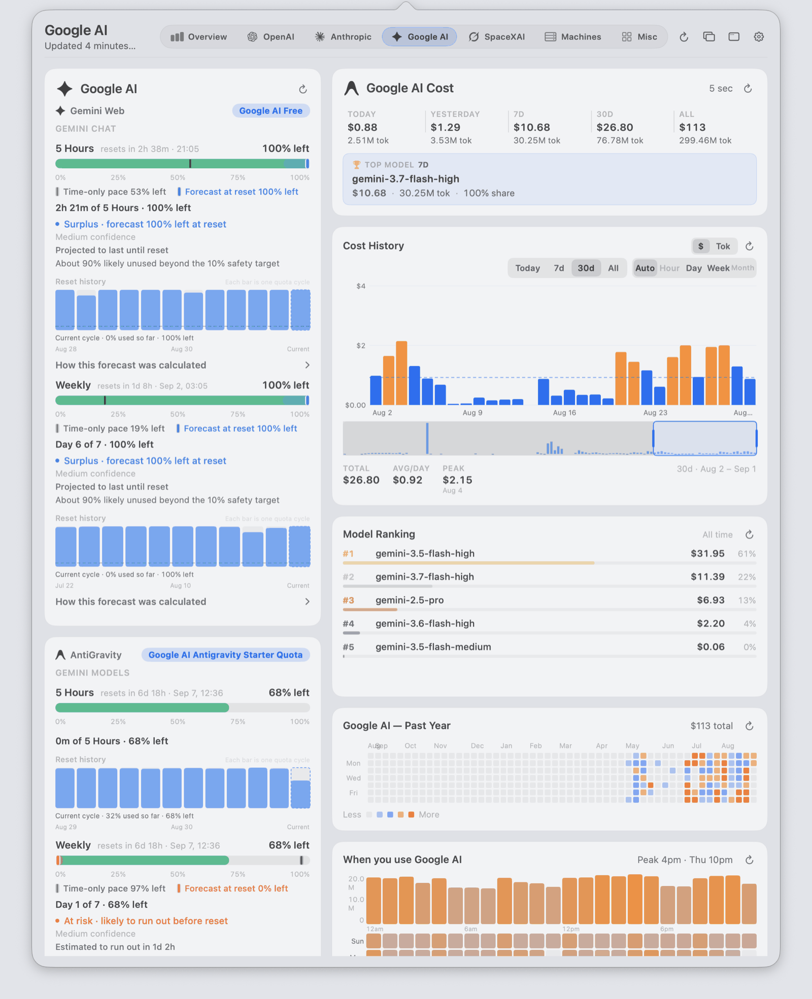<br><sub><strong>Google AI</strong> —— Gemini Web 额度，以及 AntiGravity Language Server 下 Gemini 与 Claude/GPT 模型的额度，并排展示。</sub></td>
    <td width="50%">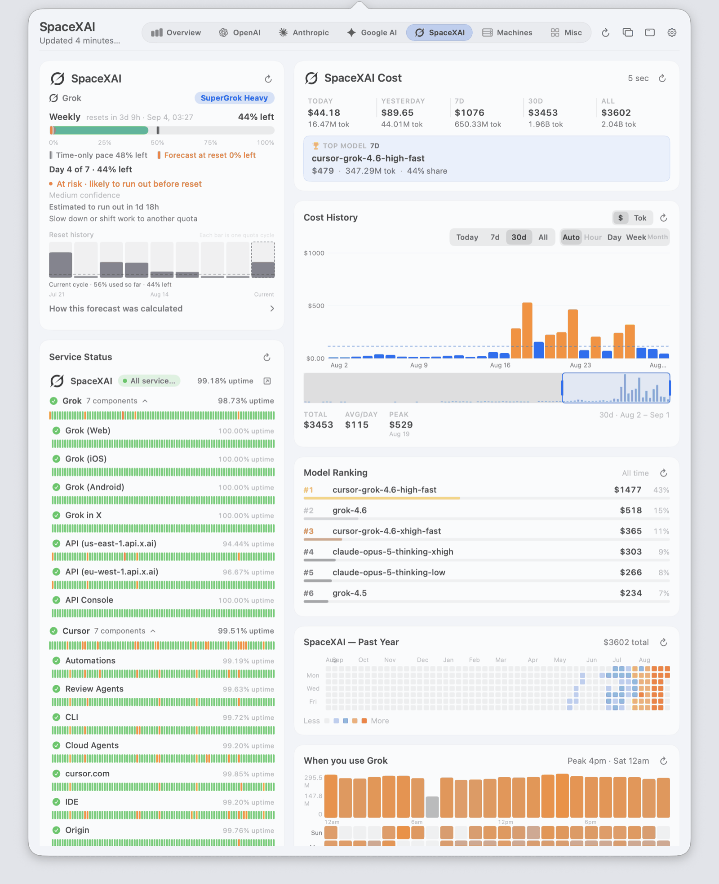<br><sub><strong>SpaceXAI</strong> —— Grok Build、Cursor 与 Grok Bot 额度，Cursor 的账户用量并入成本侧。</sub></td>
  </tr>
</table>

判断的可靠性取决于历史：新接入的服务商在积累到足够的重置周期之前会一直显示
`Learning`；预测不会假装拥有它并不具备的置信度。

## 迷你浮窗

把所有有效额度做成仪表盘，悬在工作之上——第二块屏幕、全屏终端旁边、任何你放它
的地方。迷你浮窗可以开任意多个，每个有自己的显示模式、字段选择和拖拽排列的顺序。
在浮窗上双击可循环七种模式：环形仪表、紧凑竖条、逐桶列表、单行 Strip、瓷片网格、
单厂商 Focus 大环，以及未来七天的额度重置时间轴。服务商在本构建之后新增的额度桶
会在运行时被发现、直接进入字段选择器，无需更新应用。表面是 Liquid Glass，会随
背后的内容变化。

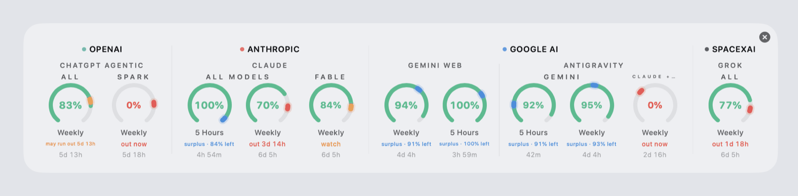

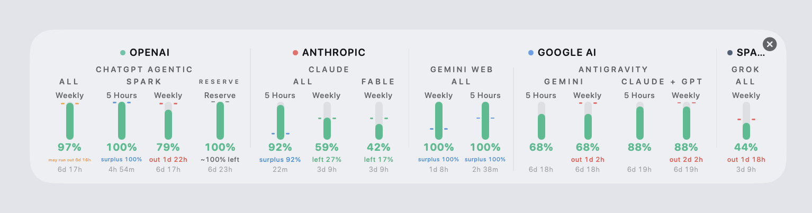

<details>
<summary>深色外观下的 Regular 迷你浮窗</summary>

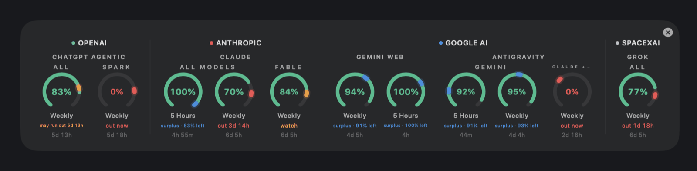

</details>

## 更多 Coding Plan

Misc 页面保留各服务商原本的额度语义，同时统一成容易扫读的卡片。现有集成包括
Copilot、OpenCode Go、Ollama Cloud、OpenRouter、Kilo、Kiro、智谱 GLM、小米 MiMo、
Kimi、MiniMax、讯飞星火、阿里百炼、火山引擎 Coding/Agent Plan、腾讯混元、百度千帆
和 Warp。在应用自带的 WebView 里登录、导入浏览器 Cookie，或者粘贴一个 Key——
服务商控制台提供什么就用什么。

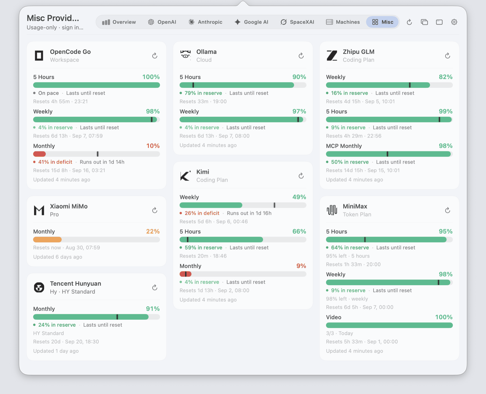

## Workbench

Popover 是用来扫一眼的。Workbench 是一扇你会一直开着的窗口。
它还刻意把两个问题分开：**哪份订阅拥有这条 quota**，以及**哪个 harness 发出了
请求**。因此共享的计费池仍然容易理解，又不会把 Claude Code、Claude Cowork、
Codex、ChatGPT Work 和其他客户端压成一个误导性的总数。

### Usage Stats

覆盖这台 Mac 上所有 harness 的逐请求账本——Claude Code、Claude Cowork、Codex、
ChatGPT Work、Cursor、Grok Build、AntiGravity、Gemini CLI——真实的 Token 数拆成
输入、输出、缓存写入和缓存读取，用和 Popover 同一份价格目录计价。按 harness、
模型和时间范围过滤；拖动导航条聚焦图表，同时看到 Token Flow、Harness、Provider、
Project、Model 五张分布环形图；表格仍保持完整窗口，并增加项目排行。

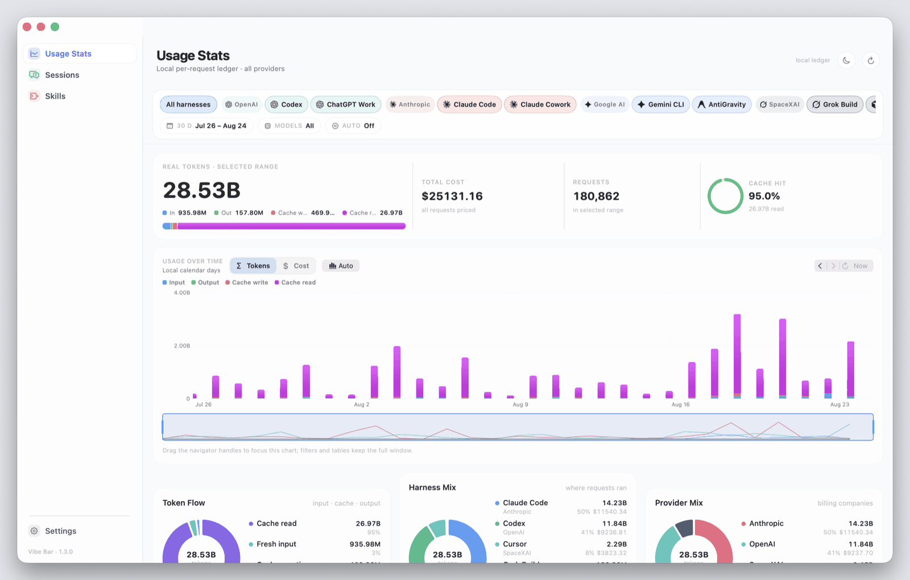

<details>
<summary>深色外观下的 Usage Stats</summary>

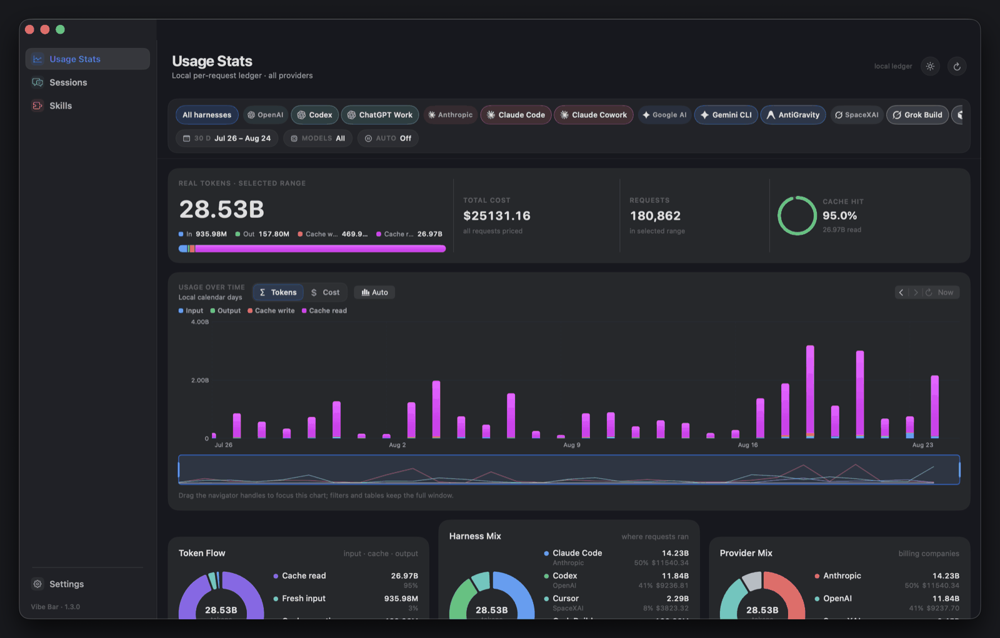

</details>

### Sessions

每一个本地 Agent 会话都被建入索引，可对提示词、回复和工具调用做全文搜索，按项目
分组，按公司、harness 或时间过滤。打开一条，transcript 就在旁边，带查找栏和分页
控制，面对上万行的 transcript 依然流畅；**Open** 把会话交还给它自己的 CLI
（`claude --resume`、`codex resume`、`grok --resume`、`agy --conversation`）。

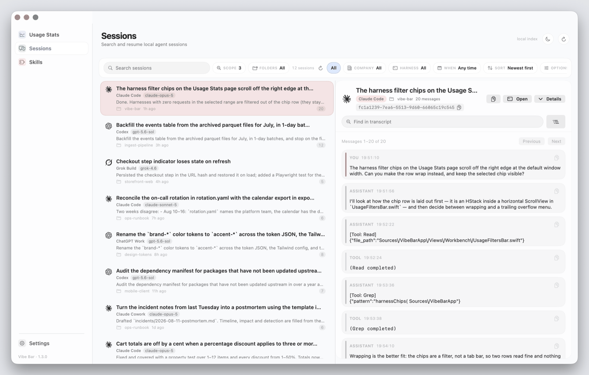

<details>
<summary>深色外观下的 Sessions</summary>

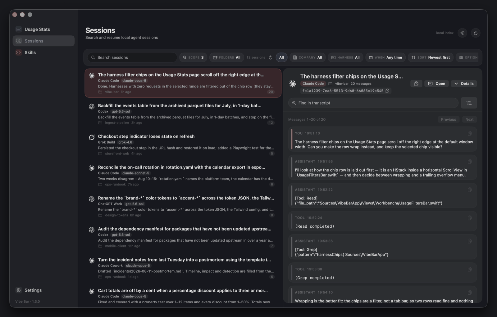

</details>

从这里删除会话，是 Vibe Bar 对 harness 会话文件做的唯一一种改动，而且只在你明确
要求时发生——见[隐私与本地数据](#隐私与本地数据)。

### Skills

一份共享库放在 `~/.agents/skills/`，对账 Codex、Claude Code、Gemini CLI、
AntiGravity、Grok Build 和 Cursor。每一行会把 harness 的真实有效状态和 Vibe Bar
管理的软链/副本分开：原生配置禁用显示暂停标记；被其它兼容目录继续暴露的 Skill
显示链环，而不会假装成“已关闭”。右键 harness 圆点可以选择原生启停或移除投影。
从 ZIP 安装、认领某个 CLI 已有的 Skill、从仓库发现更多，替换前先备份。

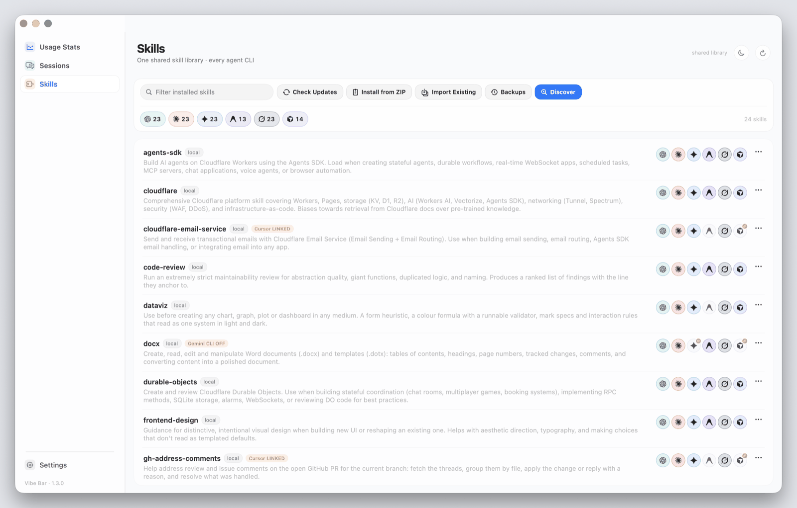

<details>
<summary>深色外观下的 Skills</summary>

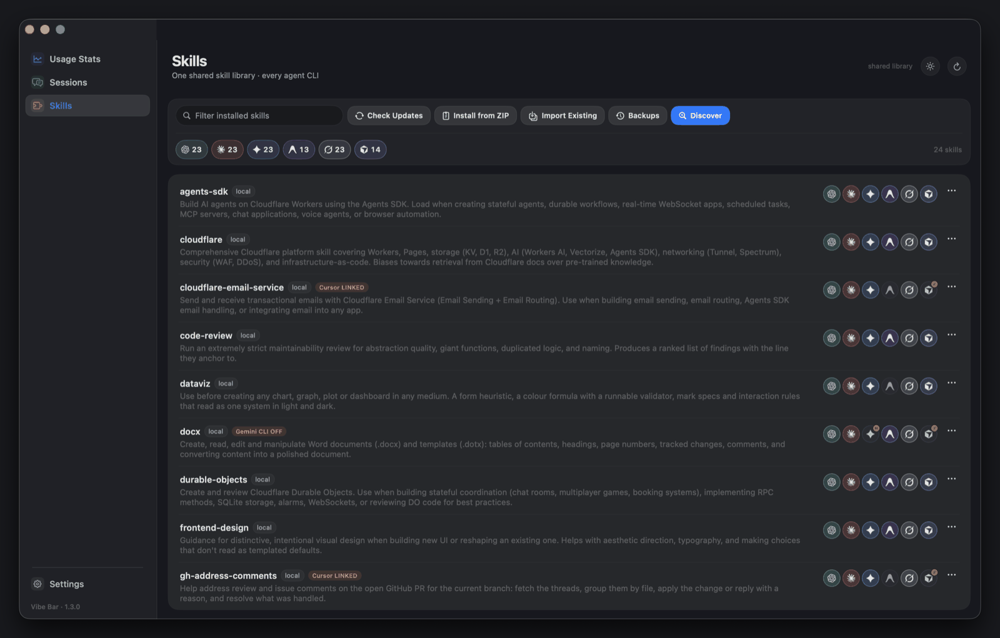

</details>

## 不打扰工作的设置

所有设置都在一个左右分栏的窗口里。有三页值得放一张图：

**Layout** 编排 Popover 每一页的卡片——显示哪些卡、放哪一列、什么顺序——有显式
Visibility 菜单、每张卡的眼睛开关、预设和实时预览，所以 Overview 可以只剩你真正
盯着的那几块。

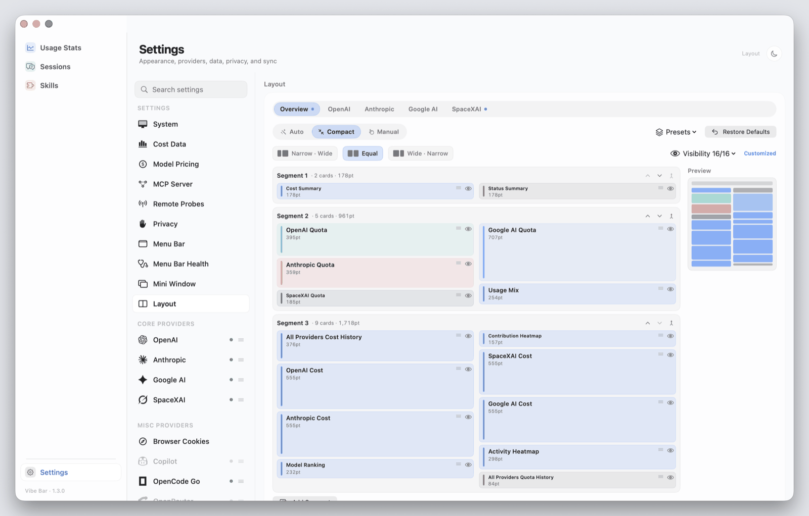

<details>
<summary>深色外观下的 Layout 编辑器</summary>

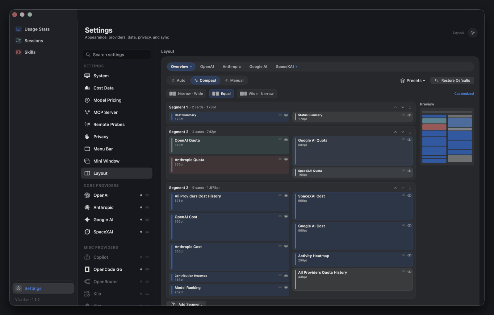

</details>

**Menu Bar** 决定菜单栏项目本身显示什么——只有图标、单行、双行或紧凑——显示
哪些额度窗口，以及颜色跟随预测还是跟随原始百分比。

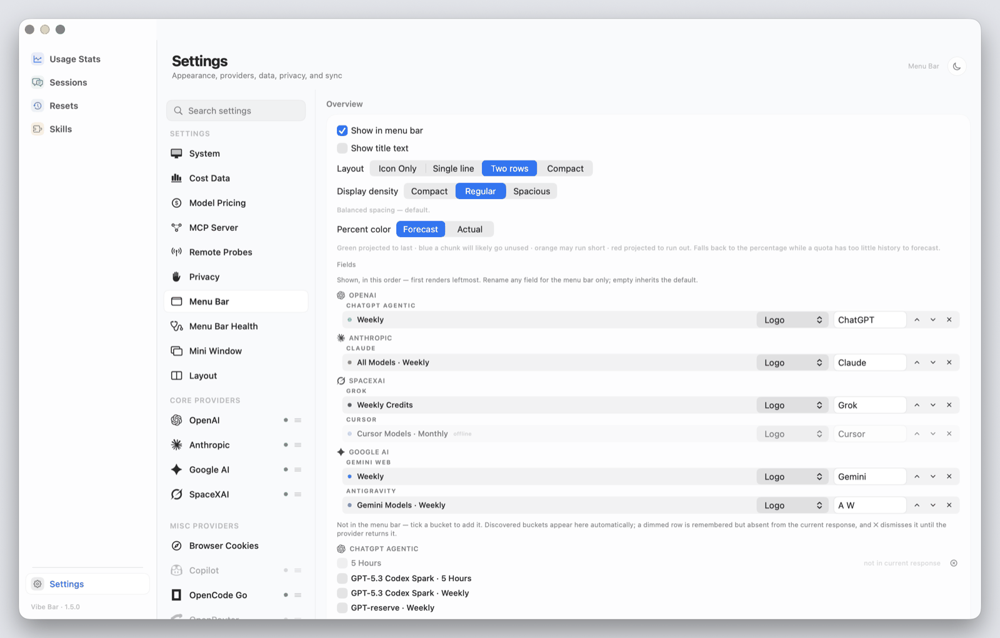

**Menu Bar Health** 同时显示 AppKit 请求状态、macOS 实际可见性、status item/window/
菜单栏高度、Control Center allow-list 审计和提醒是否被关闭。这里可以重新开启监控、
复制窄范围修复命令，或直接修复并重新注册状态项，不终止应用的 MCP 连接。
用户也可以显式开启自动修复：连续三次 probe 确认被阻挡后，执行同一条窄范围修复。

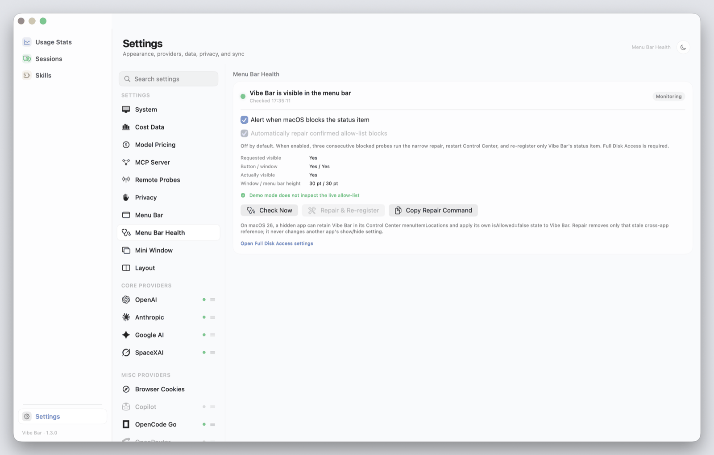

<details>
<summary>深色外观下的 Menu Bar Health</summary>

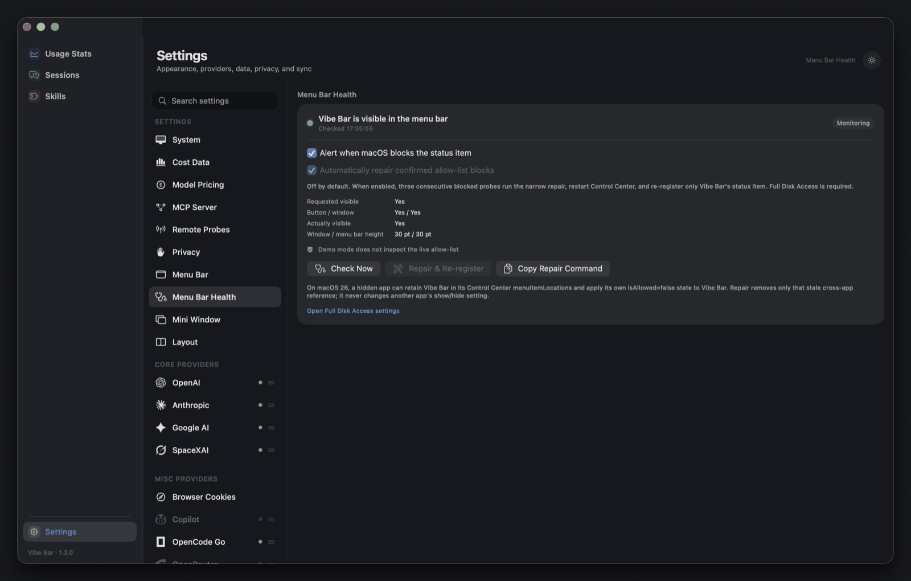

</details>

**MCP Server** 是这个应用面向 Agent 的一面，下一节讲。

## Agent 接入（MCP）

Vibe Bar 可以让你的编程 Agent 直接查询你自己的用量。应用运行时，它会在你的 home
目录下开一个只读的 MCP 服务，走 Unix domain socket——不开网络端口，也没有 API
Key——Claude Code、Codex CLI、Cursor 或任何 stdio MCP 客户端都可以来问「我的
Claude 还剩多少」「这个月谁烧的 Token 最多」或者「找一下我那个关于 parser 的会话」。
工具面覆盖缓存中的实时 quota 与预测、用量汇总/趋势/逐请求记录、成本历史、会话搜索、
服务商状态和实际生效的模型价格。

把这一行粘贴进任何能抓取 URL 的 Agent，就能完成接入：

```
Fetch and execute the appropriate instructions to set me up for Vibe Bar from https://raw.githubusercontent.com/AstroQore/vibe-bar/main/docs/agent-setup/prompt.md
```

也可以手动配置——每个客户端跑的都是同一条命令：

```sh
claude mcp add --scope user vibebar -- "/Applications/Vibe Bar.app/Contents/MacOS/VibeBar" --mcp-stdio
```

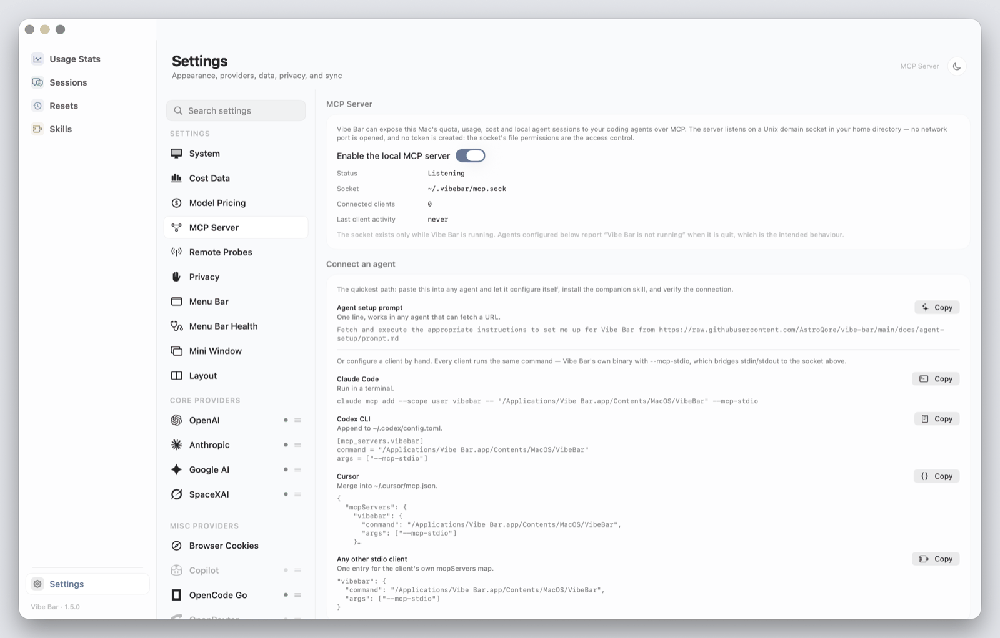

Agent 能碰到的一切都是只读的，只有一个可选开启的「刷新我的额度」工具和一个可选
开启的 Skill 安装器例外；凭据从不暴露，邮箱会做掩码。socket 以 `0600` 权限创建
在 `0700` 的 `~/.vibebar/` 里，从不绑定网络接口，Vibe Bar 退出时随之删除。

## 远端机器

独立的 [VibeBar Probe](https://github.com/AstroQore/vibebar-probe) 可以观察带
systemd 的 Linux 机器上受支持的 CLI 日志，无需开放入站端口。事实先在本地缓冲，
加密给这台 Mac 上的 Core，再经由一个看不到明文的 Relay 路由。每台机器默认不计入
你的总数，打开 **Include in totals** 之后，它的用量才会并入 Overview 和各成本页。

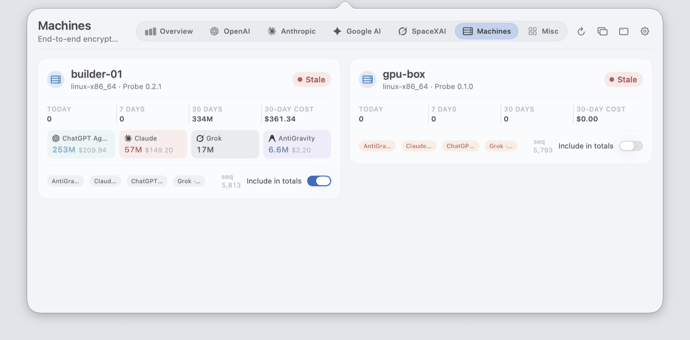

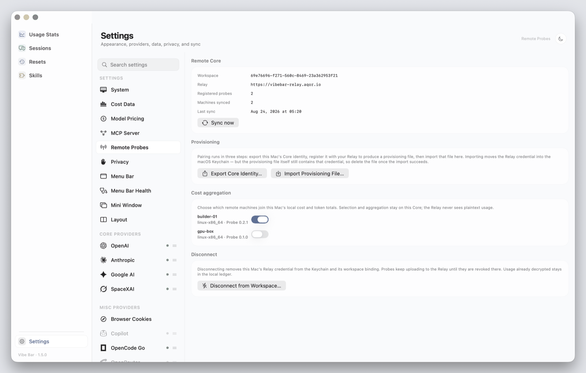

安装、纳管、更新、回滚和端到端加密模型见
[远端探针指南](https://vibebar.aqor.io/docs/zh/guide/remote-probes)。

## Vibe Bar 会读取什么

| 页面 | 配额与状态 | 成本与活动 |
| --- | --- | --- |
| ChatGPT / Codex | Codex 订阅窗口、Spark、OpenAI 状态 | `~/.codex/sessions/**/*.jsonl` |
| Claude Code / Cowork | 5 Hours、Weekly、按模型的周窗口、Anthropic 状态 | `~/.claude/projects/**/*.jsonl`，以及 Claude.app 的 Cowork transcript |
| Gemini + AntiGravity | Gemini Web 配额、本地 AntiGravity Language Server 配额 | 本地 Gemini / AntiGravity 用量记录 |
| Grok + Cursor | Grok 配额、Cursor Models 与 Other Models、Grok Bot 周配额、SpaceXAI + Cursor 状态 | 本地 Grok 记录、Cursor 账户用量事件；Grok Bot 仅显示配额 |
| Misc Providers | 各服务商自己的 Coding/Token Plan 接口 | 除非 Adapter 能取得本地用量，否则仅显示额度 |

服务商的接口随时可能变化。Vibe Bar 会明确显示刷新错误，保留上一次成功的快照，
绝不把陈旧数据伪装成一次成功更新。

## 关于截图

这一页上的每张图都是真实的应用，以它的 **demo 模式**启动：同一个二进制，指向
一个由 [`Scripts/demo_home.py`](Scripts/demo_home.py) 生成的 home 目录。额度、
预测、成本和账本的数字是一位维护者的真实用量，原样复制；所有会指向某个人的东西
——账号 ID、机器名、路径、会话、Cookie、Keychain 条目——都被替换或重新编造，
所有会离开那个目录的刷新都被关掉。Agent 会话和 Skill 是专为截图写的。
[`Scripts/capture_demo_screenshots.sh`](Scripts/capture_demo_screenshots.sh)
在两种外观下逐个打开每个界面，在纯色背景上抓图；`DemoMode.swift` 是那个开关。

## 一个产品，两个客户端

Vibe Bar 是一个 macOS 原生 App，并且会一直是：菜单栏、Liquid Glass 迷你浮窗和
Workbench 都直接构建在 AppKit 与 SwiftUI 之上，而不是用 Web 视图去近似。

Windows 与 Linux 由第二个客户端覆盖：
[**Vibe Bar Desktop**](https://github.com/AstroQore/vibe-bar-desktop)——Tauri +
Rust，同一个产品，同一份数据。两者都装在同一台 Mac 上时，它读取同一个
`~/.vibebar` 数据根——一套 Provider 账号、一套设置，不需要维护第二份；在从未装过
原生版的机器上，它也能独立运行。

目前 Desktop 只写自己的 `client/desktop/` 命名空间，不会改动本 App 拥有的数据。
让两个客户端同时对共享数据根写入是另一件事：本 App 在启动时读一次
`settings.json` 并整文件覆盖写，既不会察觉也不会合并另一个客户端的修改。

Desktop 仍在向本 App 对齐，在达成之前使用自己的 `0.x` 版本号。对齐之后两者共用
同一个 `MAJOR.MINOR.PATCH`，每次 feature release 由两个仓库同时发布。这不改变本
仓库的地位：这里是完整实现，也是"对齐"这件事的参照标准。

## 功能对照

同一个产品，两个客户端。绑定规则是 **minor 版本**：`MAJOR.MINOR` 相同即代表功能集合
相同。patch 版本可以各走各的——两边按自己的节奏修自己的 bug——build number 则始终独立。

只有两种情况豁免对齐：

- **bug 修复。**
- **在其他平台完全不存在等价物的功能。** 「实现方式不同」不算豁免：Keychain 换成
  DPAPI 或 libsecret，Sparkle 换成 Tauri updater，`SMAppService` 换成各平台的
  autostart——这些是同一个功能的不同做法。

**本表只列两者有差异的地方。** 没出现在表里的即为已对齐——配额层级、菜单栏自定义字段
与标签、会话搜索与转录、迷你窗几何持久化等等。任何一边新增功能都必须先出现在这张表里，
直到两边都落地为止。

**在那之前。** 跨平台版处于 `0.x`，本契约尚未生效：原生版可以自由发布 feature minor，
跨平台版则在补下面这张表。当跨平台版追平原生版当时的 minor 时，两边共同发布下一个 minor
作为首个联合版本——从那一刻起，任何一边都不能再发一个对方给不出的 feature minor。

图例：● 完整 · ◐ 部分 · ○ 尚未 · — 豁免

| 功能 | macOS 原生 | 跨平台 | 说明 |
| --- | :---: | :---: | --- |
| **配额** |
| 实时 Provider 取数 | ● 25 | ◐ 10 | 其余由跨平台版从共享缓存读取，并明确标注来源 |
| 浏览器 Cookie 类 Provider | ● | ○ | Windows 阻断第三方读取 Cookie，那里改为显式导入 |
| 预测判定、耗尽时间、置信度 | ● | ○ | 产品自身的立论——每根条、每个表盘都带着它 |
| 观测历史与预测历史 | ● | ○ | 实际发生了什么，以及当时预测了什么 |
| 套餐徽章与 Provider 品牌图标 | ● | ○ | 23 个品牌素材尚未移植 |
| 服务状态来源 | ● 5 | ● 4 | |
| **菜单栏 / 托盘** |
| 富文本与双行标题 | ● | — | Windows 与 Linux 的托盘根本没有标题位，只有图标 |
| 带样式作用域的字段编辑器 | ● | ○ | |
| 控制中心白名单看门狗 | ● | — | macOS 26 平台行为 |
| **主窗口** |
| Provider 详情页 | ● 4 | ○ | 跨平台版只有一个平铺的配额页 |
| 可编排的模块瀑布流 | ● 11 | ○ | |
| 带预设的布局编辑器 | ● | ○ | |
| **迷你窗口** |
| 布局 | ● 7 | ◐ 1 | 环形、紧凑、账本、条带、磁贴、聚焦、轨道 |
| 多个独立窗口 | ● | ○ | |
| 半透明表面 | ● Liquid Glass | ○ | 计划用各平台自身的模糊效果，刻意不做复刻。目前窗口是不透明的无边框窗 |
| **工作台** |
| 用量图表、环图、明细表 | ● | ○ | 跨平台版目前完全没有图表 |
| 会话删除 | ● | ○ | |
| 重置：风险视图 | ● | ○ | 依赖预测能力 |
| 技能：安装、导入、发现、备份 | ● | ◐ | 跨平台版目前是只读清单 |
| **成本与用量** |
| 本地用量扫描 | ● 7 个 harness | ◐ 3 | Codex、Claude Code、Gemini CLI。只计有本地扫描器的 harness：Cursor 的用量来自 dashboard 事件，Grok Bot 根本没有用量来源，两者在任何一边都不算本地扫描 |
| 逐请求账本、多源价格、历史 | ● | ○ | 跨平台版只保留内存中的聚合 |
| **设置** |
| 可写 | ● | ○ | 写共享数据需要跨客户端存储契约 |
| Provider 凭据面板 | ● 25 | ○ | |
| **平台** |
| MCP 工具 | ● 12 | ◐ 5 | 只读子集 |
| 远端 Probe 同步 | ● | ○ | |
| 开机启动 | ● | ○ | |
| 应用内更新 | ● Sparkle | ○ | 计划基于 Tauri updater |
| App Sandbox | ○ 刻意关闭 | ○ 暂未启用 | 两边都没有沙盒。原生版**不能**有：读取浏览器 Cookie、用 `ps`/`lsof` 探测 AntiGravity、通过 Apple 事件驱动终端，在沙盒里全部被禁，发版脚本也会拒绝带沙盒的构建。跨平台版目前只读、不需要这些，所以它才是那个*可以*沙盒的——一旦做了 Cookie 类 Provider，这个选项就关闭了 |
| Windows 与 Linux | — | ◐ | 核心已在三平台测试；GUI 只做过 macOS 验证 |

## 架构

Vibe Bar 是一个 App，由两个 SwiftPM target 加一个独立仓库的自有 package 组成。

| 组成 | 职责 | 所在仓库 |
| --- | --- | --- |
| `VibeBarApp` | 菜单栏图标、Popover、迷你浮窗、Workbench、设置界面。AppKit + SwiftUI。 | 本仓库 |
| `VibeBarCore` | 配额、用量、成本、价格、预测、Provider 适配器、远端同步——所有不需要窗口就能测试的部分。 | 本仓库 |
| [`agent-session-kit`](https://github.com/AstroQore/agent-session-kit) | 读取各家 Coding Agent 留在磁盘上的会话：按 harness 的会话发现与解析、全文会话索引、删除计划、harness 命名，以及本地 MCP Unix socket / stdio 传输。 | 独立公开仓库 |

这个 kit 是从本仓库拆出去的，目的是让「我的 agent 到底做了什么」这一半可以被单独
使用、也被单独审计。它不认识配额、套餐和价格，这套词汇留在 `VibeBarCore` 里。它
自身没有任何第三方依赖，许可证同样是 AGPL-3.0-only。

**一个 kit release 怎么到你手上。** `Package.swift` 把 kit 钉在一个确切的 tag 上，
SwiftPM 采用静态链接——它被编译进可执行文件，而不是作为一个可以替换的 framework
分发。kit 发布新版本，在 Vibe Bar 更新这个 pin 并发出新构建之前，对你的 Mac 没有
任何影响。**设置 › System › Components** 会显示当前构建里编译进去的 kit 版本，
以及一个 *Check for kit updates* 按钮；启动时不查，也没有定时任务。

## 隐私与本地数据

Vibe Bar 没有遥测管线，也没有托管的明文分析后端。本地与远端 Probe 的用量分析都
留在这台 Mac 上；可选的托管账号/控制服务只保存 Workspace、纳管、Relay 目录与审计
元数据。衍生数据保存在：

```text
~/.vibebar/
├── settings.json
├── quotas/
├── cost_snapshots/
├── scan_cache/
├── pricing_sources/
├── pricing_cache.json
├── service_status.json
├── usage_events.sqlite3
├── session_index.sqlite3
├── remote_core.json
├── remote_usage.sqlite3
├── cost_history.json
└── mcp.sock            （仅在应用运行时存在，权限 0600）
```

- CLI 的凭据与会话文件都是只读输入。唯一的例外是从 Workbench 的 Sessions 页
  整条删除会话——只在你明确要求时发生，并且从不编辑会话文件的内容。
- Skills 管理器只写 `~/.agents/skills/`、六个受管 harness 的 skills 根目录，以及
  Codex/Claude/Gemini/Grok 用户配置里明确的 Skill 启停字段；每次配置 patch 都先备份到
  `~/.vibebar/skill_backups/`。
- Vibe Bar 自己的 Cookie 与服务商密钥保存在一个带版本的 Keychain Vault 里，而不是
  每个密钥一条、各自弹窗的 Keychain 条目。
- Privacy Mode 会清除衍生的成本数据，并在开启期间不把成本历史落盘。保留期可配置，
  Cost Data 也可以手动清除。

Vibe Bar 有意**不启用 App Sandbox**：浏览器 Cookie 导入和本地 AntiGravity Language
Server 探测需要沙盒禁止的能力。应用开源，只读取需要的服务商输入；写入范围限定在
`~/.vibebar/`、Keychain Vault 和上面明确列出的 Skills allowlist。完整取舍见
[AGENTS.md](AGENTS.md#6-home-directory-and-why-we-no-longer-sandbox)。

## 安装

### 下载 Release

1. 从 [GitHub Releases](https://github.com/AstroQore/vibe-bar/releases/latest)
   下载 Apple Silicon ZIP。
2. 把 `Vibe Bar.app` 移到 `/Applications`。
3. 从「应用程序」或 Spotlight 启动。

Release 使用 ad-hoc 签名，没有做 Apple Notarization。如果 Gatekeeper 拦截首次
启动，请右键应用并选择**打开**。在本机构建和运行 Vibe Bar 不需要 Apple Developer
账号。

已安装的构建每天检查一次带签名的更新源，安装前始终会询问。**设置 › System**
可以在稳定的 **Main** 通道和预览版 **Dev** 通道之间选择；Dev 也会收到所有 Main
正式版。**检查更新…** 在菜单栏项目的右键菜单和设置里都有。

### 从源码构建

需要 macOS 26+、Xcode 26 和 Swift 6.2+。

```bash
git clone https://github.com/AstroQore/vibe-bar.git
cd vibe-bar
swift test
./Scripts/build_app.sh release
open ".build/Vibe Bar.app"
```

Swift Package 包含 `VibeBar` 可执行目标和可测试的 `VibeBarCore` 库。打包脚本会
生成 `.build/Vibe Bar.app`、复制资源与 Sparkle Framework，并对 Bundle 做
ad-hoc 签名。

## 参与贡献

- [CONTRIBUTING.md](CONTRIBUTING.md) —— 面向人类贡献者的精简说明。
- [AGENTS.md](AGENTS.md) —— 面向 Coding Agent 的完整仓库规范。
- [AGENT-PR.md](AGENT-PR.md) —— 建分支、校验、推送并创建 PR。
- [AGENT-DEPLOY.md](AGENT-DEPLOY.md) —— 构建、打包、验证，以及可选的本机安装。
- [SECURITY.md](SECURITY.md) —— 在不暴露 Secret 的前提下报告安全问题。

Provider API 和配额协议变化很快，欢迎提交聚焦的 Adapter、Fixture 与界面优化。

## 致谢

Vibe Bar 是一个独立项目，也得益于 Coding Agent 开源社区分享的工作：

- [CodexBar](https://github.com/steipete/CodexBar) 是 macOS 菜单栏配额体验的
  主要技术参考。部分浏览器 Cookie 与 Keychain 工具、Provider 行为，以及
  AntiGravity 本地探测流程，是在参考其实现后移植、简化或重新实现的。
- [CC Switch](https://github.com/farion1231/cc-switch) 为统一 Skills 工作流
  提供了参考，也是 Vibe Bar 识别现有跨 Agent Skill 布局时的互操作对象。
- [CodexBar 兼容性说明](docs/CODEXBAR-COMPATIBILITY.md) 记录了 provider 迁移边界、
  只读 bridge，以及它的 CLI 到底负责什么。
- [CLIProxyAPI](https://github.com/router-for-me/CLIProxyAPI) 及其生态帮助我们
  理解多 Provider CLI 账号与配额工作流。Vibe Bar 不内置、不启动，也不依赖
  CLIProxyAPI 运行。
- [ccusage](https://github.com/ccusage/ccusage) 为本地 Session 成本解析与定价语义
  提供了参考。
- [LiteLLM](https://github.com/BerriAI/litellm)、
  [models.dev](https://github.com/anomalyco/models.dev) 与
  [Portkey Models](https://github.com/Portkey-AI/models) 持续维护 Vibe Bar
  用于成本归集的公开模型价格目录；
  [AstroQore VibeBar Model Pricing](https://github.com/AstroQore/vibebar-model-pricing)
  维护少量 Vibe Bar 专用补充条目。

Vibe Bar 还直接使用
[SweetCookieKit](https://github.com/steipete/SweetCookieKit) 读取本地浏览器 Cookie，
并使用 [Sparkle](https://github.com/sparkle-project/Sparkle) 实现带签名的应用更新。
具体关系与许可证信息见
[THIRD_PARTY_NOTICES.md](THIRD_PARTY_NOTICES.md)；适用的完整许可证文本位于
[Resources/ThirdPartyLicenses](Resources/ThirdPartyLicenses)，并会随打包后的
App Bundle 一并提供。上述项目均与 Vibe Bar 相互独立；本致谢不表示存在隶属、
背书或其他官方关系。

## 许可证

Vibe Bar 采用
[GNU Affero General Public License v3.0 only](LICENSE) 许可。

## Star 历史

<p align="center">
  <a href="https://star-history.com/#AstroQore/vibe-bar&Date">
    
  </a>
</p>
